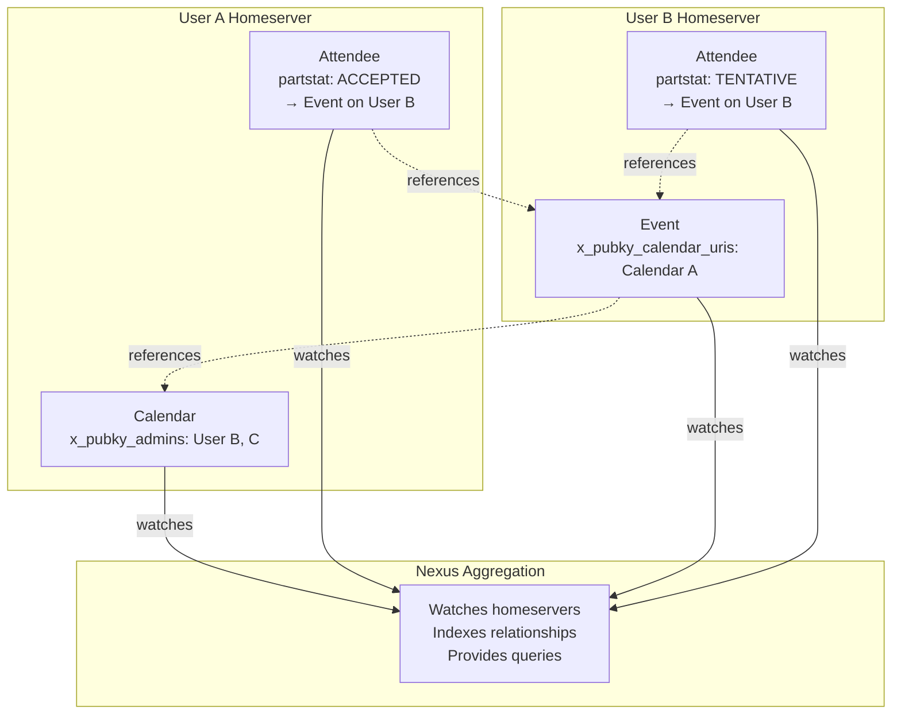
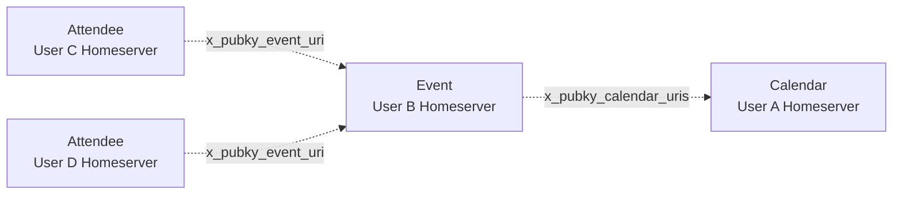
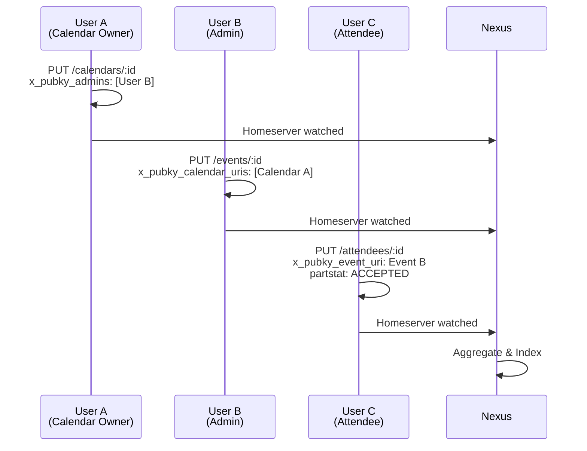

# Eventky Data Model

## Architecture

## Data Models

### Calendar
- **Path**: `/pub/eventky.app/calendars/:calendar_id` (timestamp-based ID)
- **Storage**: Owner's homeserver
- **Required**: `name`, `timezone`
- **Optional**: `color`, `image_uri`, `description`, `x_pubky_admins` (admin user URIs)

### Event
- **Path**: `/pub/eventky.app/events/:event_id` (timestamp-based ID)
- **Storage**: Creator's homeserver
- **Required**: `uid`, `summary`, `dtstart`, `dtstamp`
- **Optional**: `dtend`, `duration`, `location`, `description`, `rrule` (recurrence), `x_pubky_calendar_uris`
- **RFC 5545 compliant**

### Attendee (RSVP)
- **Path**: `/pub/eventky.app/attendees/:attendee_id` (hash of event URI + recurrence_id)
- **Storage**: Attendee's homeserver
- **Required**: `x_pubky_event_uri`, `partstat` (NEEDS-ACTION | ACCEPTED | DECLINED | TENTATIVE)
- **Optional**: `recurrence_id` (for specific recurring instances)

## Relationships

### Calendar ← Events (Many-to-Many)
- Events reference calendars via `x_pubky_calendar_uris`
- Calendar admins create events on their own homeservers
- No calendar modification needed when events added/removed
- Nexus indexes by calendar URI

### Event ← Attendees (One-to-Many)
- Attendees reference events via `x_pubky_event_uri`
- Each user's RSVP stored on their homeserver
- No event modification needed when users RSVP
- Supports instance-specific RSVPs with `recurrence_id`

## Data Flow

