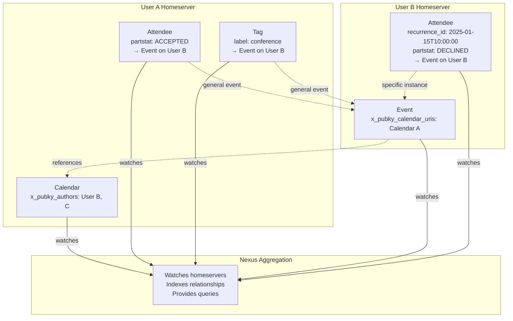
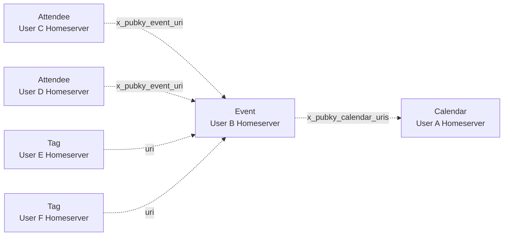
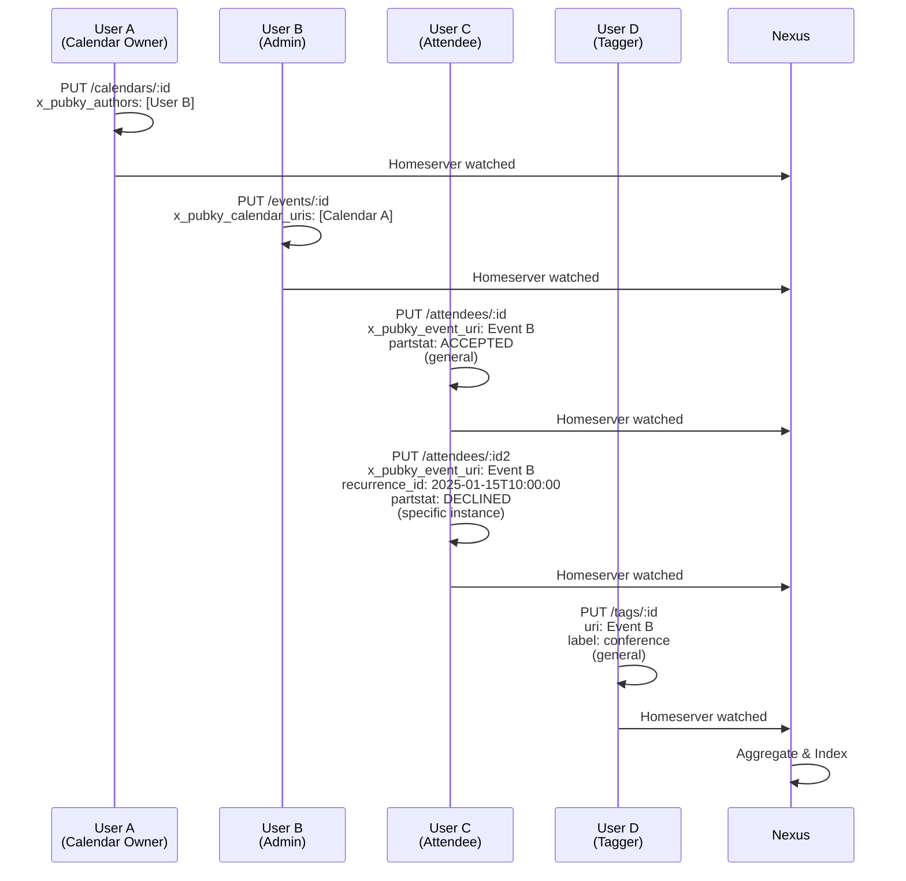

# Eventky Data Model

## Architecture

## Data Models

### Calendar
- **Path**: `/pub/eventky.app/calendars/:calendar_id` (timestamp-based ID)
- **Storage**: Owner's homeserver
- **Required**: `name`, `timezone`
- **Optional**: `color`, `image_uri`, `description`, `x_pubky_authors` (array of Pubky user URIs)

**Permission Model (`x_pubky_authors`)**:
- **Calendar Owner**: Full control (edit calendar, add/remove authors)
- **Authors** (listed in `x_pubky_authors`): Can create events that reference this calendar
- **Events remain on creator's homeserver**: Authors don't write to calendar owner's homeserver
- **Reference-based**: Events link to calendar via `x_pubky_calendar_uris`, calendar doesn't store event list
- **Max authors**: 20 users per calendar

### Event
- **Path**: `/pub/eventky.app/events/:event_id` (timestamp-based ID)
- **Storage**: Creator's homeserver
- **Required**: `uid`, `summary`, `dtstart`, `dtstamp`
- **Optional**: `dtend`, `duration`, `description`, `rrule` (recurrence), `x_pubky_calendar_uris`, `locations`
- **Locations**: Array of structured locations (max 5). See [LOCATIONS.md](LOCATIONS.md)

### Attendee (RSVP)
- **Path**: `/pub/eventky.app/attendees/:attendee_id` (hash of event URI + recurrence_id)
- **Storage**: Attendee's homeserver
- **Required**: `x_pubky_event_uri`, `partstat` (NEEDS-ACTION | ACCEPTED | DECLINED | TENTATIVE)
- **Optional**: `recurrence_id` (for specific recurring instances)
- **Examples**:
  - General event: `{ "x_pubky_event_uri": "pubky://user/.../events/123", "partstat": "ACCEPTED" }`
  - Single instance: `{ "x_pubky_event_uri": "pubky://user/.../events/123", "partstat": "DECLINED", "recurrence_id": "2025-01-15T10:00:00" }`

### Tag
- **Path**: `/pub/pubky.app/tags/:tag_id` (hash of URI + label)
- **Storage**: User's homeserver (tagger)
- **Required**: `uri` (tagged object), `label` (lowercase, trimmed), `created_at`
- **Example**: `{ "uri": "pubky://user/.../events/123", "label": "conference", "created_at": 1733932800000000 }`
- **Note**: Tags are always general (apply to entire event, not specific instances)

## Relationships

### Calendar ← Events (Many-to-Many)

**How It Works**:
- Events reference calendars via `x_pubky_calendar_uris` (array of calendar URIs)
- **Admins create events on their own homeservers** (not calendar owner's)
- No calendar modification needed when events added/removed (reference-only)
- Nexus indexes events by calendar URI to enable queries like "all events in Calendar X"

**Permission Flow**:
1. Calendar Owner adds Admin to `x_pubky_authors` array
2. Admin creates event on their homeserver with `x_pubky_calendar_uris: ["pubky://owner/.../calendars/123"]`
3. Nexus detects reference and indexes event under calendar
4. Anyone querying calendar sees events from all admins

**Key Principle**: Calendar is a grouping mechanism, not a storage container. Events are always stored on event creator's homeserver.

### Event ← Attendees (One-to-Many)
- Attendees reference events via `x_pubky_event_uri`
- Each user's RSVP stored on their homeserver
- No event modification needed when users RSVP
- Supports instance-specific RSVPs with `recurrence_id` (ISO datetime)

### Calendar/Event ← Tags (One-to-Many)
- Tags reference any object (calendar, event) via `uri`
- Each user's tags stored on their homeserver
- Tags are always general (entire event/calendar, not instances)
- Multiple users can tag the same object with different labels

## Data Flow

