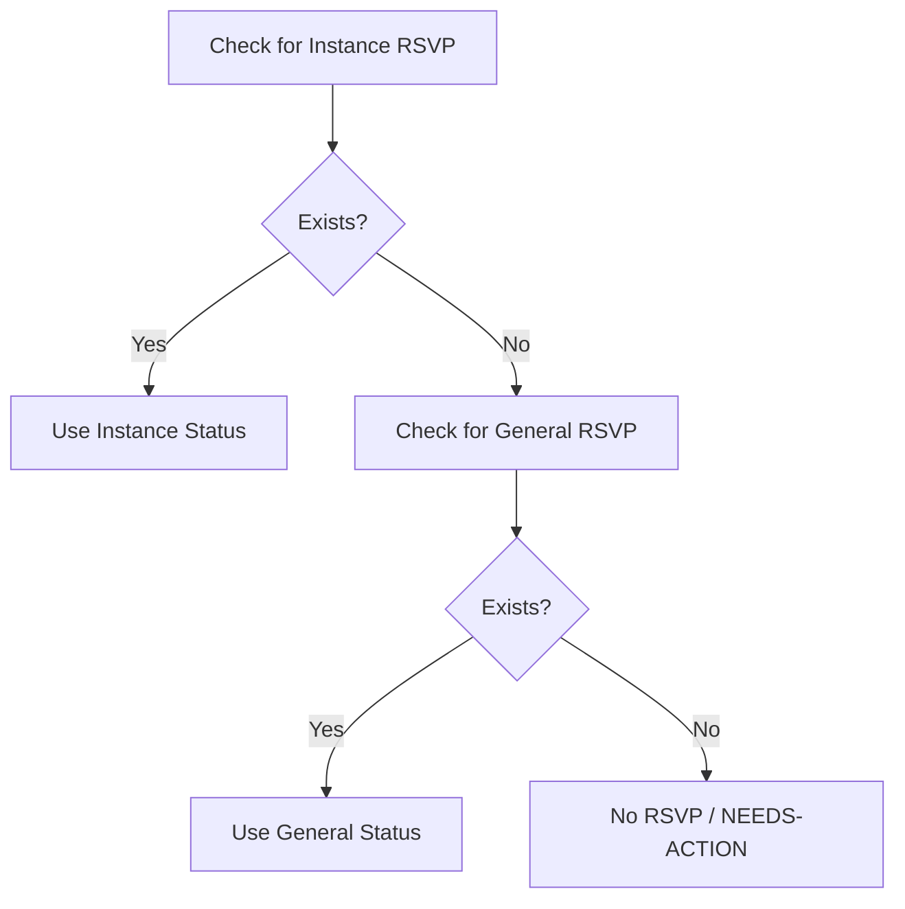
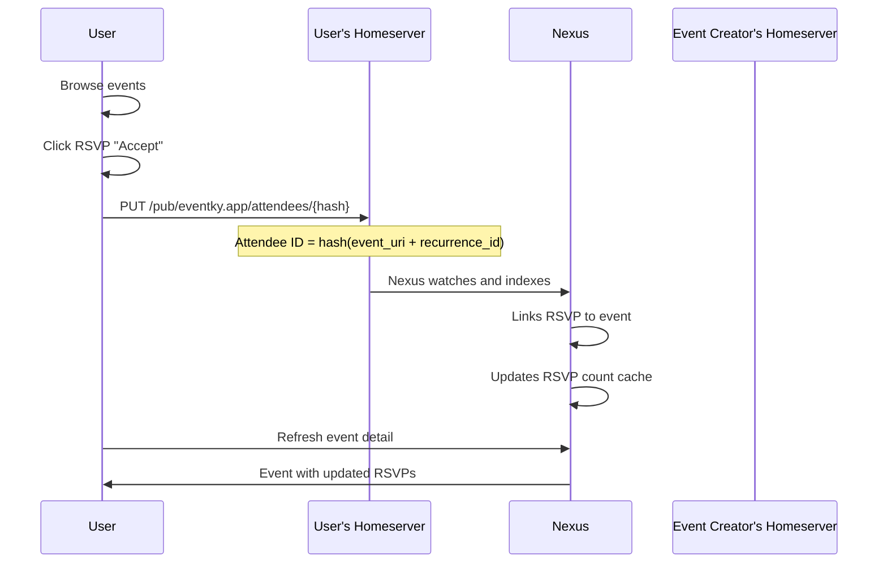
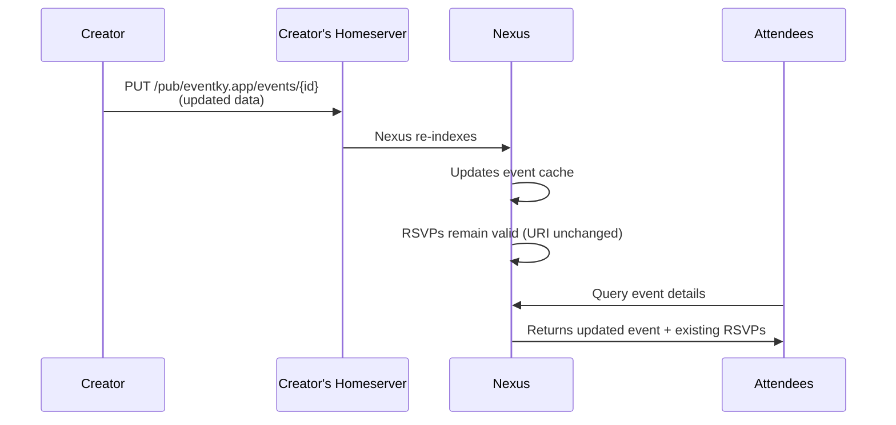
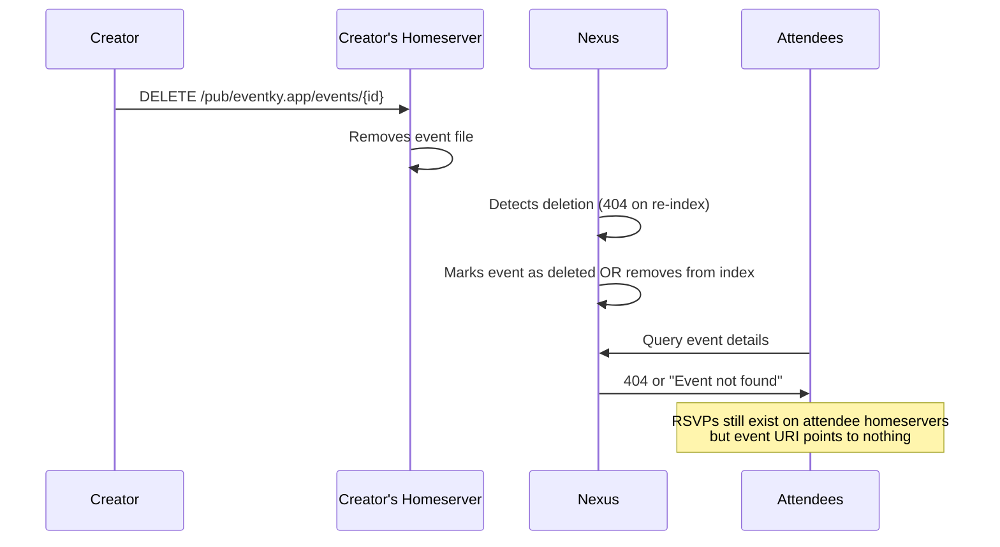
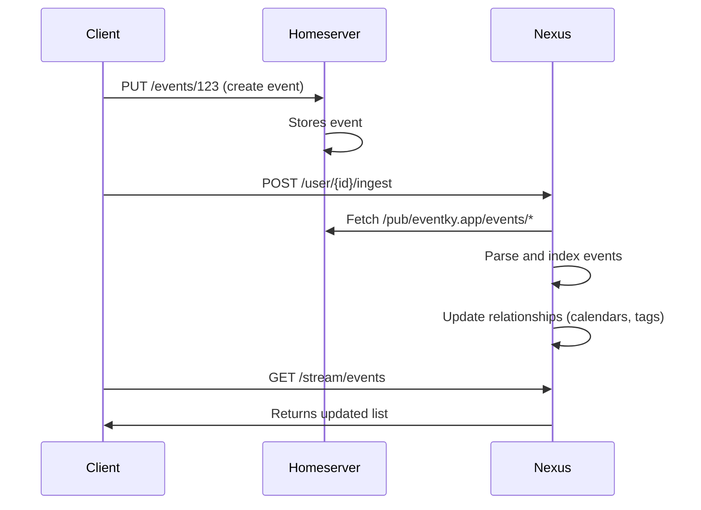

# Event & RSVP Lifecycle

Complete lifecycle documentation for events, RSVPs, and their interactions with IDs, paths, caching, and Nexus indexing.

## Event Creation

### 1. ID Generation

```typescript
// Timestamp-based ID (Ulid format)
const eventId = ulid(); // e.g., "0034B3SX1FQC0"
```

**Properties:**
- **Unique**: Timestamp + random component
- **Sortable**: Chronologically ordered
- **Immutable**: Never changes once created

### 2. Homeserver Storage

```
PUT pubky://creator/pub/eventky.app/events/0034B3SX1FQC0
```

**Data stored:**
- Event metadata (summary, dtstart, location, etc.)
- Recurrence rules (rrule, rdate, exdate)
- Calendar references (x_pubky_calendar_uris)

### 3. Nexus Indexing

1. Nexus watches homeserver for new events
2. Parses event data and validates structure
3. Indexes event with relationships:
   - Links to referenced calendars
   - Extracts tags if present
   - Stores for query access

### 4. Cache & Discovery

- Event appears in Nexus streams: `GET /v0/stream/events`
- Event detail available: `GET /v0/event/{creatorId}/{eventId}`
- Calendar listings updated (if referenced)

---

## RSVP Flow

### Attendee Object Structure

```typescript
interface PubkyAppAttendee {
    x_pubky_event_uri: string;    // Event reference (immutable)
    partstat: string;              // NEEDS-ACTION | ACCEPTED | DECLINED | TENTATIVE
    recurrence_id?: string;        // Optional: specific instance datetime
    created_at: number;
    last_modified?: number;
}
```

### General vs Instance-Specific RSVPs

**General RSVP** (Default for entire series):
```typescript
{
    x_pubky_event_uri: "pubky://creator/pub/eventky.app/events/0034B3SX1FQC0",
    partstat: "ACCEPTED",
    recurrence_id: null  // Applies to all occurrences
}
```

**Instance-Specific RSVP** (Override for one occurrence):
```typescript
{
    x_pubky_event_uri: "pubky://creator/pub/eventky.app/events/0034B3SX1FQC0",
    partstat: "DECLINED",
    recurrence_id: "2025-01-15T10:00:00"  // Only this instance
}
```

### RSVP Priority Rules

When determining status for a specific occurrence:



**Example:**
```typescript
// User has these RSVPs:
const generalRsvp = {
    recurrence_id: null,
    partstat: "ACCEPTED"  // Accepts whole series
};

const instanceRsvp = {
    recurrence_id: "2025-01-15T10:00:00",
    partstat: "DECLINED"  // Declines this one instance
};

// Result for different dates:
// - 2025-01-08: ACCEPTED (uses general)
// - 2025-01-15: DECLINED (uses instance - higher priority)
// - 2025-01-22: ACCEPTED (uses general)
```

### RSVP Creation Process



### Attendee ID Generation

```typescript
// General RSVP ID
const generalId = hash(eventUri + "");
// e.g., "0034B3RSVP1ABC"

// Instance-specific RSVP ID
const instanceId = hash(eventUri + "2025-01-15T10:00:00");
// e.g., "0034B3RSVP2XYZ"
```

**Properties:**
- **Deterministic**: Same inputs always produce same ID
- **Collision-resistant**: Hash ensures uniqueness
- **Self-describing**: ID encodes what it references

---

## Event Edits

### What Can Be Edited

**Event Creator Can Modify:**
- Summary, description, location, images
- Start/end times (dtstart, dtend, duration)
- Recurrence rules (rrule, rdate, exdate)
- Calendar associations
- Status (CONFIRMED → CANCELLED)

**Event Creator CANNOT Modify:**
- Event ID (immutable)
- Event URI (based on ID)
- Creation timestamp (dtstamp)
- Other users' RSVPs (stored on their homeservers)

### Edit Flow



### Impact on RSVPs

| Edit Type | RSVP Impact | Notes |
|-----------|-------------|-------|
| **Summary changed** | ✅ No impact | RSVPs reference URI, not content |
| **dtstart changed** | ⚠️ Semantically stale | RSVPs remain in graph, but recurrence_id may no longer match new dtstart pattern |
| **rrule changed** | ⚠️ Potential orphans | Instance RSVPs may point to non-existent occurrences (no validation in Nexus) |
| **Status → CANCELLED** | ℹ️ Informational | RSVPs remain, UI should show "Cancelled" badge |
| **Event deleted** | ❌ Orphaned | Event node removed with `DETACH DELETE`, RSVPs lose RSVP_TO relationship |

### Orphaned RSVPs (Recurrence Changes)

**Problem:**
```typescript
// Original event: Every Wednesday
rrule: "FREQ=WEEKLY;BYDAY=WE"

// User RSVPs to specific instance
recurrence_id: "2025-01-15T10:00:00"  // Wednesday

// Creator changes to Fridays
rrule: "FREQ=WEEKLY;BYDAY=FR"

// Result: January 15 is no longer an occurrence
// User's RSVP is now semantically orphaned (still in graph, but invalid)
```

**Current Nexus Behavior:**
- **No validation** of `recurrence_id` against RRULE expansions
- RSVPs remain in graph even if `recurrence_id` doesn't match RRULE
- `RSVP_TO` relationship persists until RSVP is explicitly deleted

**Client Responsibility:**
- Expand current RRULE to get valid occurrences
- Filter RSVPs to only show matching `recurrence_id` values
- **Orphaned RSVPs are hidden from UI** (not deleted from homeserver/Nexus, just not displayed)
- General RSVPs (without `recurrence_id`) always remain valid

### Cache Invalidation

```typescript
// After event edit
queryClient.invalidateQueries({
    queryKey: ['events', eventId]
});
queryClient.invalidateQueries({
    queryKey: ['events']  // Stream queries
});
queryClient.invalidateQueries({
    queryKey: ['calendar', calendarId]  // If calendar-referenced
});
```

---

## Event Deletion

### Deletion Flow



### What Happens to RSVPs?

**Attendee Homeservers:**
- RSVPs remain stored (creator can't delete others' data)
- `x_pubky_event_uri` points to deleted event (returns 404)

**Current Nexus Behavior:**
- Event node removed with `DETACH DELETE` (Neo4j command)
- All relationships deleted including `[:RSVP_TO]` edges from Attendee nodes
- Event removed from Redis cache
- **RSVPs become orphaned**: Attendee nodes remain but lose connection to Event

**Result:**
- Attendee nodes still exist in graph (not cascade deleted)
- `RSVP_TO` relationships are severed
- Queries like "get attendees for event" return empty results
- Queries like "get user's RSVPs" still return orphaned Attendee nodes
- Fetching event details for orphaned RSVP returns 404

**UI Behavior:**
- Event no longer appears in discovery streams
- Direct links to event show "Event not found"
- User's RSVP list shows RSVPs where event lookup fails (404)
- UI should detect 404 and show "Event deleted" or offer cleanup

### Cleanup Recommendations

**For Attendees (Client-Side):**
- Periodically check RSVPs and detect 404 events
- UI can offer "Clean up deleted events" button
- Delete orphaned Attendee objects from homeserver
- Trigger Nexus ingest to remove orphaned Attendee nodes

**For Nexus (Future Improvements):**
- Implement cascade delete: `DELETE (e:Event)` → also `DELETE (a:Attendee)-[:RSVP_TO]->(e)`
- Periodic garbage collection job: detect Attendee nodes with no `RSVP_TO` relationship
- Provide `/orphaned-rsvps` endpoint for users to discover cleanup candidates
- Consider soft-delete pattern: mark events as `deleted: true` instead of removing nodes

---

## ID Stability & Path Structure

### Event URIs

```
pubky://{creator_id}/pub/eventky.app/events/{event_id}
```

**Immutable Components:**
- `creator_id`: User's public key (never changes)
- `event_id`: Timestamp-based Ulid (never changes)

**Why Stable:**
- Enables reliable cross-references (RSVPs, tags, calendar links)
- No cascading updates when event content changes
- Supports offline-first sync (eventual consistency)

### Attendee URIs

```
pubky://{attendee_id}/pub/eventky.app/attendees/{attendee_hash}
```

**Attendee Hash:**
```typescript
const attendeeId = hash(eventUri + (recurrenceId || ""));
```

**Examples:**
- General: `hash("pubky://creator/.../events/123" + "")`
- Instance: `hash("pubky://creator/.../events/123" + "2025-01-15T10:00:00")`

**Why Deterministic:**
- One RSVP per user per event (or per instance)
- Prevents duplicate RSVPs
- Enables idempotent updates (PUT same ID = update, not duplicate)

### Calendar References

```typescript
interface PubkyAppEvent {
    x_pubky_calendar_uris: string[];  // Array of calendar URIs
}

// Example:
x_pubky_calendar_uris: [
    "pubky://organizer/pub/eventky.app/calendars/0034CAL1ABC",
    "pubky://partner/pub/eventky.app/calendars/0034CAL2XYZ"
]
```

**Many-to-Many:**
- Events can reference multiple calendars
- Calendars don't store event lists (references point event → calendar)
- Nexus builds reverse index for queries

---

## Cache Invalidation Strategy

### Query Keys

```typescript
// Streams (all events)
['events', filters]

// Single event with RSVPs
['events', eventId]
['events', eventId, 'attendees']

// Calendar events
['calendar', calendarId, 'events']

// User's RSVPs
['user', userId, 'attendees']

// Tags
['tags', eventId]
```

### Invalidation Triggers

| Action | Invalidates | Reason |
|--------|-------------|--------|
| **Create event** | `['events']` | New event in stream |
| **Update event** | `['events', eventId]`, `['events']` | Content changed |
| **Delete event** | `['events', eventId]`, `['events']` | Event removed |
| **Create RSVP** | `['events', eventId]`, `['user', userId, 'attendees']` | RSVP count changed |
| **Update RSVP** | `['events', eventId]`, `['user', userId, 'attendees']` | Status changed |
| **Delete RSVP** | `['events', eventId]`, `['user', userId, 'attendees']` | RSVP removed |
| **Add tag** | `['tags', eventId]`, `['events']` | Tag list changed |

### Optimistic Updates

**Event Creation:**
```typescript
// 1. Add to cache immediately (pending)
queryClient.setQueryData(['events'], (old) => [...old, pendingEvent]);

// 2. Submit to homeserver
await createEvent(eventData);

// 3. On success: trigger Nexus ingest, invalidate
await ingestUser(userId);
queryClient.invalidateQueries(['events']);

// 4. On error: remove pending event
queryClient.setQueryData(['events'], (old) => old.filter(e => e.id !== pendingId));
```

**RSVP Creation:**
```typescript
// 1. Update RSVP count optimistically
queryClient.setQueryData(['events', eventId], (old) => ({
    ...old,
    attendee_count: old.attendee_count + 1
}));

// 2. Submit to homeserver
await createRsvp(rsvpData);

// 3. On success: invalidate to fetch real data
queryClient.invalidateQueries(['events', eventId]);

// 4. On error: rollback count
queryClient.setQueryData(['events', eventId], (old) => ({
    ...old,
    attendee_count: old.attendee_count - 1
}));
```

---

## Nexus Ingest Workflow

### Manual Ingest Trigger

After creating/updating/deleting events:

```typescript
POST /v0/user/{userId}/ingest
```

**Purpose:**
- Forces Nexus to re-scan user's homeserver
- Updates index with latest data
- Typically called after homeserver writes

### Ingest Flow



### Automatic Watch (Future)

Nexus may implement automatic watching:
- Real-time updates without manual ingest calls
- WebSocket or SSE for live changes
- Reduces latency for multi-user scenarios

---

## Edge Cases & Considerations

### Multiple RSVPs to Same Event

**Scenario:**
```typescript
// User creates BOTH general and instance-specific RSVPs
{
    recurrence_id: null,
    partstat: "ACCEPTED"
}
{
    recurrence_id: "2025-01-15T10:00:00",
    partstat: "DECLINED"
}
```

**Behavior:**
- Both RSVPs are valid and stored
- Instance-specific takes precedence for that date
- General applies to all other dates
- UI merges them intelligently per occurrence

### RSVP to Non-Existent Instance

**Scenario:**
```typescript
// Event: Every Monday
rrule: "FREQ=WEEKLY;BYDAY=MO"

// User RSVPs to a Tuesday (invalid)
recurrence_id: "2025-01-14T10:00:00"  // Tuesday
```

**Current Behavior:**
- RSVP is stored on homeserver (no validation)
- Nexus indexes Attendee node and creates `[:RSVP_TO]` relationship
- **No validation** that `recurrence_id` matches RRULE expansion
- RSVP remains in graph as valid relationship

**Client Responsibility:**
- Expand RRULE to get valid occurrence dates
- **Filter out RSVPs** where `recurrence_id` doesn't match any occurrence
- UI will NOT display this RSVP (client-side filtering)
- RSVP is effectively orphaned from UI perspective (but still in database)

### Event Time Zone Changes

**Scenario:**
```typescript
// Original
dtstart: "2025-01-15T10:00:00"
dtstart_tzid: "America/New_York"

// Changed to
dtstart_tzid: "Europe/London"

// User's RSVP:
recurrence_id: "2025-01-15T10:00:00"  // Still matches (time is abstract)
```

**Behavior:**
- `recurrence_id` is stored as-is (no timezone in format)
- RFC 5545 treats `recurrence_id` as "floating" (matches dtstart pattern)
- RSVP remains valid even if timezone changes

### Concurrent Edits (No Locking)

**Scenario:**
- User A and User B both edit the same event simultaneously
- No distributed locking in Pubky

**Behavior:**
- Last write wins (homeserver overwrites file)
- Nexus indexes most recent version
- No conflict resolution or version history
- **Recommendation:** UI should show "last modified" timestamp and warn on stale edits

---

## Summary

| Lifecycle Stage | Key Points |
|-----------------|------------|
| **Event Creation** | Timestamp-based ID, stored on creator's homeserver, Nexus indexes |
| **RSVP Creation** | Deterministic hash ID, stored on attendee's homeserver, instance-specific overrides general |
| **Event Edits** | URI stable, RSVPs remain valid unless recurrence changes orphan instances |
| **Event Deletion** | Creator removes file, RSVPs become orphaned, Nexus handles cleanup |
| **ID Stability** | Immutable URIs enable reliable cross-references and eventual consistency |
| **Cache Strategy** | Optimistic updates for UX, invalidate on success, rollback on error |
| **Spam Prevention** | Relies on future Nexus trust graphs and moderation, no web-of-trust in MVP |
