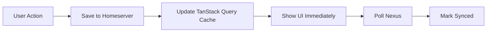
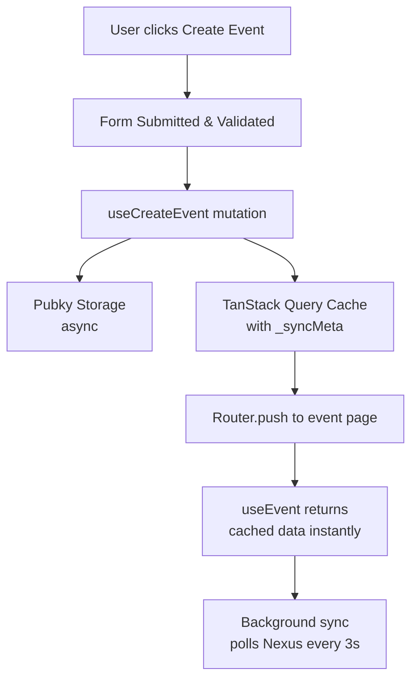
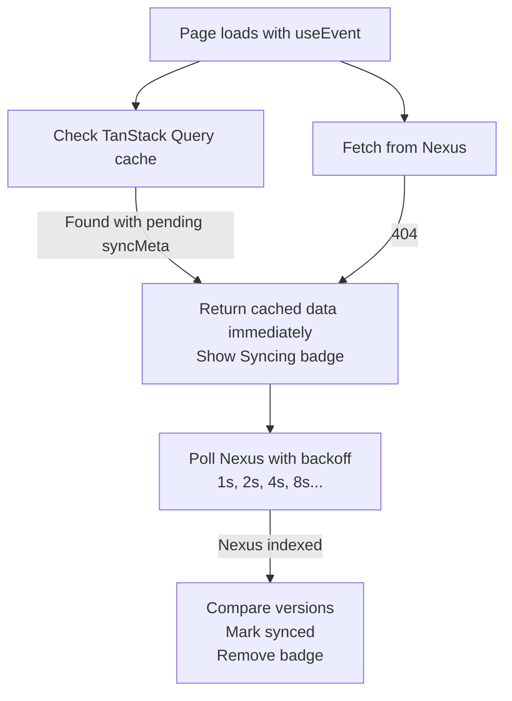

# Optimistic Caching

Instant UI updates when creating/editing events. Data is saved to homeserver and
shown immediately while Nexus indexes in background.

## Architecture

**TanStack Query-Only** - All caching is handled by TanStack Query with localStorage persistence.
No Zustand store is used for caching.

## Flow



## Usage

```typescript
import { useCreateEvent, useEvent } from "@/hooks";

// Query with sync status
const { data, syncStatus, isOptimistic } = useEvent(authorId, eventId);
// syncStatus: "pending" | "syncing" | "synced" | "error"

// Mutation with optimistic update
const { mutateAsync: createEvent } = useCreateEvent();
await createEvent({ event, eventId });
```

## Key Files

| File                                      | Purpose                                      |
| ----------------------------------------- | -------------------------------------------- |
| `types/nexus.ts`                          | Unified types with embedded sync metadata    |
| `lib/cache/pending-writes.ts`             | Centralized pending writes tracking          |
| `lib/cache/sync.ts`                       | Version comparison, data merging             |
| `hooks/use-event-hooks.ts`                | TanStack Query event hooks with sync status  |
| `hooks/use-calendar-hooks.ts`             | TanStack Query calendar hooks with sync      |
| `hooks/use-event-mutations.ts`            | Event mutation hooks (create/update/delete)  |
| `hooks/use-calendar-mutations.ts`         | Calendar mutation hooks                      |
| `lib/cache/utils.ts`                      | Query keys, config constants                 |
| `components/ui/sync-status-indicator.tsx` | Sync badge UI                                |
| `components/providers/query-provider.tsx` | TanStack Query persistence setup             |

## Sync Metadata Pattern

Data returned from hooks includes embedded `_syncMeta`:

```typescript
interface SyncMetadata {
  lastFetched: number;
  source: "local" | "nexus" | "merged";
  version?: { sequence?: number; lastModified?: number };
  synced: boolean;
  syncAttempts: number;
}
```

## Version Comparison

Uses RFC 5545 fields: `sequence` → `last_modified` → `indexed_at`

## Config

```typescript
// lib/cache/utils.ts
SYNC_CONFIG = {
  INITIAL_SYNC_DELAY: 1000, // 1s before first check
  SYNC_INTERVAL: 3000, // 3s between checks
  MAX_SYNC_ATTEMPTS: 20,
  MAX_SYNC_TIME: 60000, // Give up after 60s
};
```

**GlobalSyncIndicator** (`components/providers/cache-sync-provider.tsx`):

- Shows floating indicator when items are syncing
- Appears in bottom-right corner
- Uses TanStack Query's `useIsFetching` and `useIsMutating`

## Version Comparison Strategy

The system uses RFC 5545 versioning fields from `pubky-app-specs`:

1. **`sequence`**: Modification counter (0, 1, 2, ...)
   - Incremented on each edit
   - Higher sequence = newer version

2. **`last_modified`**: Unix microseconds timestamp
   - Used as tiebreaker when sequences match

3. **`indexed_at`**: Nexus processing timestamp
   - Fallback comparison when above fields aren't available

```typescript
// lib/cache/sync.ts
function compareVersions(a, b): number {
  // First by sequence
  if (a.sequence !== b.sequence) return (a.sequence ?? 0) - (b.sequence ?? 0);
  // Then by last_modified
  if (a.lastModified !== b.lastModified) {
    return (a.lastModified ?? 0) - (b.lastModified ?? 0);
  }
  return 0;
}
```

## Data Flow Examples

### Creating an Event



### Viewing an Event (after create)



## Configuration

### Sync Timing (`lib/cache/utils.ts`)

```typescript
export const SYNC_CONFIG = {
  INITIAL_SYNC_DELAY: 1000, // Wait 1s before first check
  SYNC_INTERVAL: 3000, // Base interval (with backoff)
  MAX_SYNC_ATTEMPTS: 20, // Give up after 20 attempts
  MAX_SYNC_TIME: 60000, // Max 60s total
  OPTIMISTIC_STALE_TIME: 30000, // Refetch every 30s for unsynced
};
```

### TanStack Query Persistence (`components/providers/query-provider.tsx`)

```typescript
// localStorage persistence with 24-hour max age
const persister = createSyncStoragePersister({
  storage: typeof window !== "undefined" ? window.localStorage : undefined,
});

<PersistQueryClientProvider
  client={queryClient}
  persistOptions={{
    persister,
    maxAge: 1000 * 60 * 60 * 24, // 24 hours
  }}
>
```

## Error Handling

1. **Mutation Failure**: Rollback TanStack Query cache, show toast error
2. **Nexus 404**: Keep showing cached data, continue polling
3. **Network Error**: Retry with backoff, don't clear cache
4. **Max Attempts Reached**: Mark as "error" status, stop polling

## Pending Writes

The `lib/cache/pending-writes.ts` module tracks writes that haven't synced to Nexus:

```typescript
// Track a pending event write
setPendingEvent(authorId, eventId, eventData, sequence);

// Check if write is pending
const pending = getPendingEvent(authorId, eventId);

// Remove after sync confirmed
clearPendingEvent(authorId, eventId);

// Auto-cleanup after 30s TTL
```
