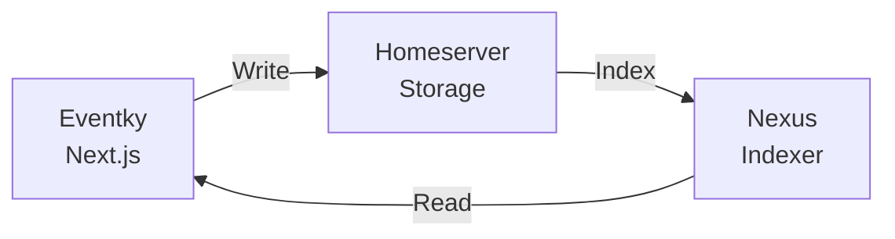

# Eventky MVP Scope

> Short roadmap and integration points for the Pubky Events MVP

View example Screenshots under [docs/screenshots](./screenshots/)


## Architecture



- **Homeserver**: Stores events, calendars, RSVPs as JSON blobs
- **Nexus**: Indexes and aggregates data for queries
- **Eventky**: UI for creating/viewing events

## MVP Features

### ✅ In Scope

| Feature  | Notes                                       |
| --------------------- | ------------------------------------------- |
| **Event CRUD**        | Create/edit/delete events on homeserver     |
| **Nexus Endoints**       | New Nexus endpoints for event/calendar indexing and querying |
| **Calendar grouping** | Group events into calendars with admins |
| **Basic recurrence**  | RRULE, RDATE, EXDATE (RFC 5545)             |
| **RSVP system**       | Accept/Decline/Tentative per event/instance using PubkyAppAttendee |
| **Tagging**           | Allow PubkyAppTag for PubkyAppEvent and PubkyAppCalendar                 |
| **Event discovery**   | `/events` feed listing events in a Card based layout with basic filtering using Nexus filters        |
| **Calendar discovery**   | `/calendars` feed listing calendars with basic filtering using Nexus filters. Calendar-View and Card based UI       |
| **Event pages**   | Event detail view with RSVP and tags; Create/edit forms       |
| **Calendar  pages**   | Calendar detail view with events - Calendar-View and Card based UI; Create/edit forms       |
| **Multi-homeserver**  | Attendees and Tags from different homeservers using Nexus        |
| **Image uploads**     | Event images via Pubky files                |
| **Rich descriptions** | HTML formatted event descriptions           |
| **Webcal Endpoint**   | iCal feed for calendars and events          |


### ❌ Out of Scope (MVP)

| Feature                | Reason                           |
| ---------------------- | -------------------------------- |
| Notifications/alerts   | Can easily be added later     |
| Recurrence overrides   | Per-instance changes too complex |
| Multiple and Structured Locations   | OpenStreetMap and other structured location integration for different types like Parking Garage, Restaurant, Jitsi-Url and more       |
| Waitlists/invitations  | Advanced RSVP features can be extended at a later stage when required           |
| Attendee limits        | Capacity management              |
| CalDAV RW operations   | Seperate Bridge with complexity    |

## Integration Points

### Pubky App Specs (WASM)

```typescript
import { PubkySpecsBuilder } from "pubky-app-specs";

// Create events with validation
const builder = new PubkySpecsBuilder(userId);
const result = builder.createEvent(eventData);

// Parse URIs
const parsed = parse_uri("pubky://userId/pub/eventky.app/events/eventId");
...
```

### Nexus API

```typescript
// Event streams
GET /v0/stream/events

// Single event with tags/attendees  
GET /v0/event/{authorId}/{eventId}

// User ingest (trigger indexing)
POST /v0/user/{userId}/ingest
```

### Data Paths (Homeserver)

| Resource  | Path                                      |
| --------- | ----------------------------------------- |
| Events    | `/pub/eventky.app/events/{eventId}`       |
| Calendars | `/pub/eventky.app/calendars/{calendarId}` |
| Attendees | `/pub/eventky.app/attendees/{attendeeId}` |
| Tags      | `/pub/pubky.app/tags/{tagId}`             |
| Files     | `/pub/pubky.app/files/{fileId}`           |
| Blobs     | `/pub/pubky.app/blobs/{blobId}`           |

## Key Files

```
eventky/
├── lib/
│   ├── pubky/           # Pubky SDK wrappers
│   │   ├── client.ts    # Authentication
│   │   ├── event-utils.ts
│   │   └── files.ts     # Image uploads
│   ├── nexus/           # Nexus API clients
│   │   ├── events.ts
│   │   ├── calendars.ts
│   │   └── ingest.ts
│   └── datetime/        # RFC 5545 datetime handling
├── hooks/
│   ├── use-event-optimistic.ts   # Event queries + optimistic updates
│   └── use-rsvp-mutation.ts      # RSVP handling
├── components/
│   ├── event/           # Event forms and display
│   └── calendar/        # Calendar components
└── stores/
    └── event-form-store.ts       # Form state management
```
