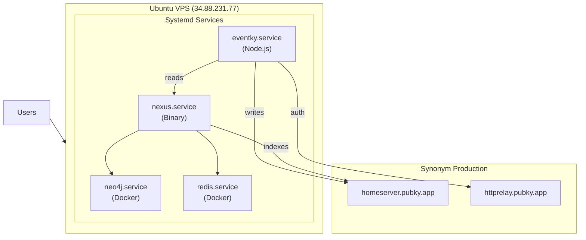

# VPS Setup Guide

## Quick Reference (Daily Operations)

**SSH into VPS:**
```bash
ssh eventky@34.88.231.77
```

**Access URLs:**
- App: https://eventky.app
- Nexus API: https://nexus.eventky.app
- Swagger UI: https://nexus.eventky.app/swagger-ui/

**Update to latest main:**
```bash
cd ~/apps/eventky && git pull && npm ci && npm run build && sudo systemctl restart eventky.service
```

**Test a different branch:**
```bash
cd ~/apps/eventky && git fetch origin && git checkout BRANCH_NAME && npm ci && npm run build && sudo systemctl restart eventky.service
```

**View logs:**
```bash
sudo journalctl -u eventky.service -f     # Eventky logs
sudo journalctl -u nexus.service -f       # Nexus logs
```

**Check status:**
```bash
sudo systemctl status eventky.service nexus.service eventky-db.service
```

---

## Architecture



---

## Phase 1: VPS Initial Setup

### 1.1 Connect and Update

```bash
ssh root@34.88.231.77

# Update system
sudo apt update && sudo apt upgrade -y

# Install essential packages
sudo apt install -y curl wget git build-essential
```

### 1.2 Create App User

```bash
# Create dedicated user for running services
sudo adduser --disabled-password --gecos "" eventky
sudo usermod -aG sudo eventky

# Allow sudo without password (optional, for convenience)
echo "eventky ALL=(ALL) NOPASSWD:ALL" | sudo tee /etc/sudoers.d/eventky
# Switch to eventky user
sudo su - eventky
```

### 1.3 Install Docker

```bash
# Install Docker
curl -fsSL https://get.docker.com | sh
sudo usermod -aG docker $USER

# Logout and login to apply docker group
exit
sudo su - eventky

# Verify
docker --version
```

### 1.4 Install Node.js

```bash
# Install nvm
curl -o- https://raw.githubusercontent.com/nvm-sh/nvm/v0.40.1/install.sh | bash
source ~/.bashrc

# Install Node.js 20 LTS
nvm install 20
nvm use 20
nvm alias default 20

# Verify
node --version  # Should be v20.x.x
npm --version
```

### 1.5 Install Rust (for building Nexus)

```bash
curl --proto '=https' --tlsv1.2 -sSf https://sh.rustup.rs | sh -s -- -y
source ~/.cargo/env

# Verify
rustc --version
cargo --version
```

### 1.6 Install ImageMagick (for Nexus image processing)

```bash
# Required for Nexus to create avatar/image variants (thumbnails, resizing)
sudo apt install -y imagemagick

# Verify
convert --version

## Phase 2: Database Setup (Docker)

### 2.1 Create Directory Structure

```bash
mkdir -p ~/apps/docker/neo4j/{conf,data,logs}
mkdir -p ~/apps/docker/redis/data
cd ~/apps/docker
```

### 2.2 Create Docker Compose File

Create `~/apps/docker/docker-compose.yml`:

```yaml
services:
  neo4j:
    image: neo4j:5.26.7-community
    container_name: neo4j
    restart: unless-stopped
    ports:
      - "7474:7474"
      - "7687:7687"
    volumes:
      - ./neo4j/conf:/conf:Z
      - ./neo4j/data:/data:Z
      - ./neo4j/logs:/logs:Z
    environment:
      NEO4J_initial_dbms_default__database: neo4j
      NEO4J_AUTH: neo4j/eventky_neo4j_secure_2024
      NEO4J_server_memory_pagecache_size: 512M
      NEO4J_server_memory_heap_initial__size: 512M
      NEO4J_server_memory_heap_max__size: 1G

  redis:
    image: redis/redis-stack:7.2.0-v11
    container_name: redis
    restart: unless-stopped
    ports:
      - "6379:6379"
      - "8001:8001"
    volumes:
      - ./redis/data:/data
```

### 2.3 Start Databases

```bash
docker compose up -d

# Verify
docker compose ps
docker compose logs neo4j
docker compose logs redis
```

### 2.4 Create Systemd Service for Docker Compose

Create `/etc/systemd/system/eventky-db.service`:

```ini
[Unit]
Description=Eventky Databases (Neo4j + Redis)
Requires=docker.service
After=docker.service

[Service]
Type=oneshot
RemainAfterExit=yes
User=eventky
WorkingDirectory=/home/eventky/apps/docker
ExecStart=/usr/bin/docker compose up -d
ExecStop=/usr/bin/docker compose down

[Install]
WantedBy=multi-user.target
```

Enable the service:

```bash
sudo systemctl daemon-reload
sudo systemctl enable eventky-db.service
```

---

## Phase 3: Nexus Setup

### 3.1 Clone and Build Nexus

```bash
cd ~/apps
git clone https://github.com/gillohner/pubky-nexus.git
cd pubky-nexus

# Build release binary (takes ~5-10 minutes)
cargo build --release -p nexusd

# Verify binary
./target/release/nexusd --help
```

### 3.2 Create Nexus Config

```bash
mkdir -p ~/apps/nexus-config
mkdir -p ~/apps/nexus-data/static/files
```

Create `~/apps/nexus-config/config.toml`:

```toml
[api]
name = "nexusd.api"
public_ip = "34.88.231.77"
public_addr = "0.0.0.0:8080"
pubky_listen_socket = "0.0.0.0:8081"

[watcher]
name = "nexusd.watcher"
# IMPORTANT: Set to false for production homeserver
testnet = false
# Required field even when testnet=false
testnet_host = "localhost"
homeserver = "ufibwbmed6jeq9k4p583go95wofakh9fwpp4k734trq79pd9u1uy"
events_limit = 50
# Maximum number of monitored homeservers. If set to 1, only the default homeserver is monitored.
monitored_homeservers_limit = 50
watcher_sleep = 5000
moderation_id = "aaaaaaaaaaaaaaaaaaaaaaaaaaaaaaaaaaaaaaaaaaaaaaaaaaaa"
moderated_tags = [
    "hatespeech",
    "harassement",
    "terrorism",
    "violence",
    "illegal_activities",
    "il_adult_nu_sex_act",
]

[stack]
log_level = "info"
files_path = "/home/eventky/apps/nexus-data/static/files"

[stack.db]
redis = "redis://127.0.0.1:6379"

[stack.db.neo4j]
uri = "bolt://127.0.0.1:7687"
password = "eventky_neo4j_secure_2024"
```

### 3.3 Create Nexus Systemd Service

Create `/etc/systemd/system/nexus.service`:

```ini
[Unit]
Description=Pubky Nexus Indexer
After=network.target eventky-db.service
Requires=eventky-db.service

[Service]
Type=simple
User=eventky
Environment=RUST_LOG=info
WorkingDirectory=/home/eventky/apps/pubky-nexus
ExecStart=/home/eventky/apps/pubky-nexus/target/release/nexusd --config-dir /home/eventky/apps/nexus-config
Restart=on-failure
RestartSec=10

[Install]
WantedBy=multi-user.target
```

Enable and start the service:

```bash
sudo systemctl daemon-reload
sudo systemctl enable nexus.service
sudo systemctl start nexus.service

# Check status
sudo systemctl status nexus.service
sudo journalctl -u nexus.service -f
```

### 3.4 Verify Nexus

```bash
# Check API is responding
curl http://localhost:8080/v0/info

# Swagger UI should be accessible at:
# http://34.88.231.77:8080/swagger-ui/
```

---

## Phase 4: Eventky Setup

### 4.1 Clone Repository

```bash
cd ~/apps
git clone https://github.com/gillohner/eventky.git
cd eventky
```

### 4.2 Install pubky-app-specs

```bash
# Clone and build locally
cd ~/apps
git clone https://github.com/gillohner/pubky-app-specs.git
cd pubky-app-specs
# Build WASM package (requires wasm-pack)
cargo install wasm-pack
./build.sh

# Return to eventky and link
cd ~/apps/eventky
npm install ../pubky-app-specs/pkg
```

### 4.3 Install Dependencies

```bash
cd ~/apps/eventky
npm ci
```

### 4.4 Create Environment File

Create `~/apps/eventky/.env.local`:

```bash
# Production environment with custom Nexus
NEXT_PUBLIC_PUBKY_ENV=production

# Override gateway to use VPS Nexus
NEXT_PUBLIC_PUBKY_GATEWAY=http://34.88.231.77:8080

# Use production Synonym homeserver (default for production env)
# NEXT_PUBLIC_PUBKY_HOMESERVER=ufibwbmed6jeq9k4p583go95wofakh9fwpp4k734trq79pd9u1uy

# Use production Synonym relay (default for production env)
# NEXT_PUBLIC_PUBKY_RELAY=https://httprelay.pubky.app/link/

# App configuration
NEXT_PUBLIC_APP_NAME=Eventky Demo
NEXT_PUBLIC_APP_VERSION=0.1.0
NEXT_PUBLIC_GITHUB_REPO=https://github.com/gillohner/eventky

# Debug available for demo
NEXT_PUBLIC_DEBUG_AVAILABLE=true
```

### 4.5 Build Production Bundle

```bash
npm run build
```

### 4.6 Create Eventky Systemd Service

Create `/etc/systemd/system/eventky.service`:

```ini
[Unit]
Description=Eventky Next.js Application
After=network.target nexus.service

[Service]
Type=simple
User=eventky
WorkingDirectory=/home/eventky/apps/eventky
Environment=NODE_ENV=production
Environment=PORT=3000
Environment=PATH=/home/eventky/.nvm/versions/node/v20.19.6/bin:/usr/local/sbin:/usr/local/bin:/usr/sbin:/usr/bin:/sbin:/bin
ExecStart=/home/eventky/.nvm/versions/node/v20.19.6/bin/npm start
Restart=on-failure
RestartSec=10

[Install]
WantedBy=multi-user.target
```

Enable and start the service:

```bash
sudo systemctl daemon-reload
sudo systemctl enable eventky.service
sudo systemctl start eventky.service

# Check status
sudo systemctl status eventky.service
sudo journalctl -u eventky.service -f
```

**Note:** Adjust the Node.js path in `ExecStart` based on your installed version:
```bash
which node  # Shows the correct path
```

## Phase 5: Verification

### 5.1 Check All Services

```bash
# Check service status
sudo systemctl status eventky-db.service
sudo systemctl status nexus.service
sudo systemctl status eventky.service

# Check Docker containers
docker ps

# Check ports
sudo netstat -tlnp | grep -E '3000|6379|7474|7687|8080'
```

### 5.2 Test Endpoints

```bash
# Eventky frontend
curl -I http://34.88.231.77:3000

# Nexus API
curl http://34.88.231.77:8080/v0/info

# Neo4j (if port open)
curl -I http://34.88.231.77:7474
```

### 5.3 Access URLs

| Service | URL |
|---------|-----|
| **Eventky** | http://34.88.231.77:3000 |
| **Nexus API** | http://34.88.231.77:8080 |
| **Nexus Swagger** | http://34.88.231.77:8080/swagger-ui/ |
| **Neo4j Browser** | http://34.88.231.77:7474 |
| **Redis Insight** | http://34.88.231.77:8001 |

---

## Phase 6: Domain & SSL Setup (nginx + Let's Encrypt)

### 6.1 Install nginx

```bash
sudo apt install -y nginx
sudo systemctl enable nginx
sudo systemctl start nginx
```

### 6.2 Configure DNS Records

| Type | Name | Value | TTL |
|------|------|-------|-----|
| A | @ | 34.88.231.77 | 3600 |
| A | nexus | 34.88.231.77 | 3600 |

### 6.3 Required Firewall Ports

Configure your cloud provider's firewall (or local firewall like UFW/iptables) to allow the following ports:

**Essential Ports (Required for HTTPS setup):**
- `tcp:80` - HTTP (nginx) - Required for Let's Encrypt certificate validation
- `tcp:443` - HTTPS (nginx) - Required for secure web access
- `tcp:22` - SSH - For remote management

**Application Ports (Can be internal-only after nginx setup):**
- `tcp:3000` - Eventky (Next.js) - Can be localhost-only after nginx reverse proxy
- `tcp:8080` - Nexus API - Can be localhost-only after nginx reverse proxy

**Database Ports (Should be internal-only):**
- `tcp:7474` - Neo4j Browser - Optional, for debugging (recommend localhost-only or VPN)
- `tcp:7687` - Neo4j Bolt - Should be localhost-only
- `tcp:6379` - Redis - Should be localhost-only
- `tcp:8001` - Redis Insight - Optional, for debugging (recommend localhost-only or VPN)

**Recommended Configuration:**

After nginx is set up with SSL, only ports 80, 443, and 22 need to be open to the public internet. All other ports should be restricted to localhost or accessible only via VPN/SSH tunnel for administrative purposes.

### 6.4 Install Certbot (Let's Encrypt)

```bash
sudo apt install -y certbot python3-certbot-nginx
```

### 6.5 Create nginx Configuration for Eventky

Create `/etc/nginx/sites-available/eventky.app`:

```nginx
server {
    listen 80;
    listen [::]:80;
    server_name eventky.app www.eventky.app;

    location / {
        proxy_pass http://localhost:3000;
        proxy_http_version 1.1;
        proxy_set_header Upgrade $http_upgrade;
        proxy_set_header Connection 'upgrade';
        proxy_set_header Host $host;
        proxy_cache_bypass $http_upgrade;
        proxy_set_header X-Real-IP $remote_addr;
        proxy_set_header X-Forwarded-For $proxy_add_x_forwarded_for;
        proxy_set_header X-Forwarded-Proto $scheme;
        
        # Next.js specific timeouts
        proxy_read_timeout 60s;
        proxy_connect_timeout 60s;
        proxy_send_timeout 60s;
        
        # Fix for Next.js chunk loading errors
        proxy_buffering off;
        proxy_request_buffering off;
    }
}
```

Enable the site:

```bash
sudo ln -sf /etc/nginx/sites-available/eventky.app /etc/nginx/sites-enabled/
```

### 6.6 Create nginx Configuration for Nexus

Create `/etc/nginx/sites-available/nexus.eventky.app`:

```nginx
server {
    listen 80;
    listen [::]:80;
    server_name nexus.eventky.app;

    location / {
        proxy_pass http://localhost:8080;
        proxy_http_version 1.1;
        proxy_set_header Host $host;
        proxy_set_header X-Real-IP $remote_addr;
        proxy_set_header X-Forwarded-For $proxy_add_x_forwarded_for;
        proxy_set_header X-Forwarded-Proto $scheme;
        
        # CORS headers for API
        add_header 'Access-Control-Allow-Origin' '*' always;
        add_header 'Access-Control-Allow-Methods' 'GET, POST, PUT, DELETE, OPTIONS' always;
        add_header 'Access-Control-Allow-Headers' 'Origin, X-Requested-With, Content-Type, Accept, Authorization' always;
        
        # Handle preflight requests
        if ($request_method = 'OPTIONS') {
            add_header 'Access-Control-Allow-Origin' '*';
            add_header 'Access-Control-Allow-Methods' 'GET, POST, PUT, DELETE, OPTIONS';
            add_header 'Access-Control-Allow-Headers' 'Origin, X-Requested-With, Content-Type, Accept, Authorization';
            add_header 'Access-Control-Max-Age' 1728000;
            add_header 'Content-Type' 'text/plain; charset=utf-8';
            add_header 'Content-Length' 0;
            return 204;
        }
    }
}
```

Enable the site:

```bash
sudo ln -sf /etc/nginx/sites-available/nexus.eventky.app /etc/nginx/sites-enabled/
```

### 6.7 Remove Default nginx Site

```bash
sudo rm -f /etc/nginx/sites-enabled/default
```

### 6.8 Test nginx Configuration

```bash
sudo nginx -t
```

If successful, reload nginx:
```bash
sudo systemctl reload nginx
```

### 6.9 Get Certbot SSL Certificates

**Note:** You don't need a DNS record for `www.eventky.app` unless you want it. You can skip it:

```bash
# Get certificates for both domains (without www)
sudo certbot --nginx -d eventky.app -d nexus.eventky.app
```

### 6.10 Test Auto-Renewal

```bash
sudo certbot renew --dry-run
```

### 6.11 Update Eventky Environment

Update `~/apps/eventky/.env.local` to use the new domain:

```bash
# Production environment with custom Nexus
NEXT_PUBLIC_PUBKY_ENV=production

# Override gateway to use domain
NEXT_PUBLIC_PUBKY_GATEWAY=https://nexus.eventky.app

# Use production Synonym homeserver (default for production env)
# NEXT_PUBLIC_PUBKY_HOMESERVER=ufibwbmed6jeq9k4p583go95wofakh9fwpp4k734trq79pd9u1uy

# Use production Synonym relay (default for production env)
# NEXT_PUBLIC_PUBKY_RELAY=https://httprelay.pubky.app/link/

# App configuration
NEXT_PUBLIC_APP_NAME=Eventky
NEXT_PUBLIC_APP_VERSION=0.1.0
NEXT_PUBLIC_GITHUB_REPO=https://github.com/gillohner/eventky

# Debug available for demo
NEXT_PUBLIC_DEBUG_AVAILABLE=true
```

Rebuild and restart:

```bash
cd ~/apps/eventky
npm run build
sudo systemctl restart eventky.service
```

### 6.12 Verify SSL Setup

```bash
# Check SSL certificates
curl -I https://eventky.app
curl -I https://nexus.eventky.app

# Test Nexus API
curl https://nexus.eventky.app/v0/info
```

### 6.13 Final Access URLs

| Service | URL |
|---------|-----|
| **Eventky** | https://eventky.app |
| **Nexus API** | https://nexus.eventky.app |
| **Nexus Swagger** | https://nexus.eventky.app/swagger-ui/ |
| **Neo4j Browser** | http://34.88.231.77:7474 (internal only) |
| **Redis Insight** | http://34.88.231.77:8001 (internal only) |


### 6.14 nginx Troubleshooting

```bash
# Check nginx status
sudo systemctl status nginx

# View nginx error logs
sudo tail -f /var/log/nginx/error.log

# View nginx access logs
sudo tail -f /var/log/nginx/access.log

# Test configuration syntax
sudo nginx -t

# Reload after config changes
sudo systemctl reload nginx

# Restart if needed
sudo systemctl restart nginx
```

### 6.15 Certificate Renewal

Certbot sets up automatic renewal via systemd timer. Check renewal status:

```bash
# Check renewal timer
sudo systemctl status certbot.timer

# List certificates
sudo certbot certificates

# Manual renewal (if needed)
sudo certbot renew
```

---


## Management Commands

### Service Control

```bash
# Start all
sudo systemctl start eventky-db.service
sudo systemctl start nexus.service
sudo systemctl start eventky.service

# Stop all
sudo systemctl stop eventky.service
sudo systemctl stop nexus.service
sudo systemctl stop eventky-db.service

# Restart individual service
sudo systemctl restart eventky.service

### Update Eventky (Main Branch)

```bash
cd ~/apps/eventky
git pull
npm ci
npm run build
sudo systemctl restart eventky.service
```~/apps/eventky
git pull
npm ci
npm run build
sudo systemctl restart eventky.service
```

### Test a Feature Branch on VPS

```bash
cd ~/apps/eventky

# 1. Save current state (optional - useful if you have local changes)
git stash

# 2. Fetch all remote branches
git fetch origin

# 3. Checkout the feature branch
git checkout feature/some-branch
# Or create local tracking branch:
git checkout -b feature/some-branch origin/feature/some-branch

# 4. Install dependencies (in case package.json changed)
npm ci

# 5. Build and restart
npm run build
sudo systemctl restart eventky.service

# 6. Test the feature...

# 7. When done, go back to main
git checkout main
git pull
npm ci
npm run build
sudo systemctl restart eventky.service

# 8. Restore any stashed changes (if needed)
git stash pop
```

### Update Nexus

```bash
cd ~/apps/pubky-nexus
git pull
cargo build --release -p nexusd
sudo systemctl restart nexus.service
```

**Important:** After pulling updates, always check if the config needs updating by comparing with the default config:

```bash
# Check for new config fields in the updated code
cat ~/apps/pubky-nexus/nexus-common/default.config.toml

# If new fields are added, update your config
nano ~/apps/nexus-config/config.toml
```

Common config updates after major merges:
- New required fields (like `monitored_homeservers_limit`)
- Updated homeserver IDs
- New feature flags

### Reset Nexus Index

```bash
# Stop Nexus
sudo systemctl stop nexus.service

# Clear Neo4j data
docker exec neo4j cypher-shell -u neo4j -p eventky_neo4j_secure_2024 "MATCH (n) DETACH DELETE n"

# Clear Redis cursor
docker exec redis redis-cli FLUSHDB

# Restart Nexus (will re-index from homeserver)
sudo systemctl start nexus.service
```

---

## Troubleshooting

| Issue | Check |
|-------|-------|
| Nexus not starting | `journalctl -u nexus.service -e` |
| Can't connect to Neo4j | Password in config matches docker-compose |
| Eventky build fails | Node version (`node -v`), dependencies |
| Login not working | Production relay URL, CORS |
| Events not appearing | Nexus logs, homeserver connection |

### Common Fixes

```bash
# If Neo4j auth fails, reset:
cd ~/apps/docker
docker compose down -v
rm -rf neo4j/data/*
docker compose up -d

# If Eventky won't start, check Node path:
which node
# Update systemd service with correct path

```

---
