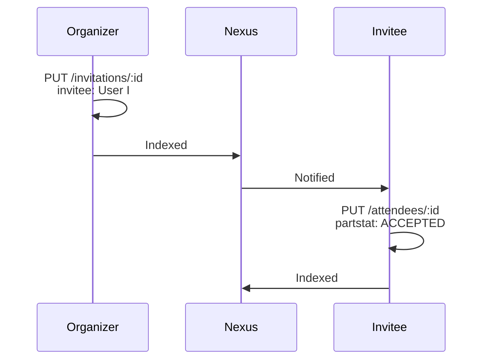
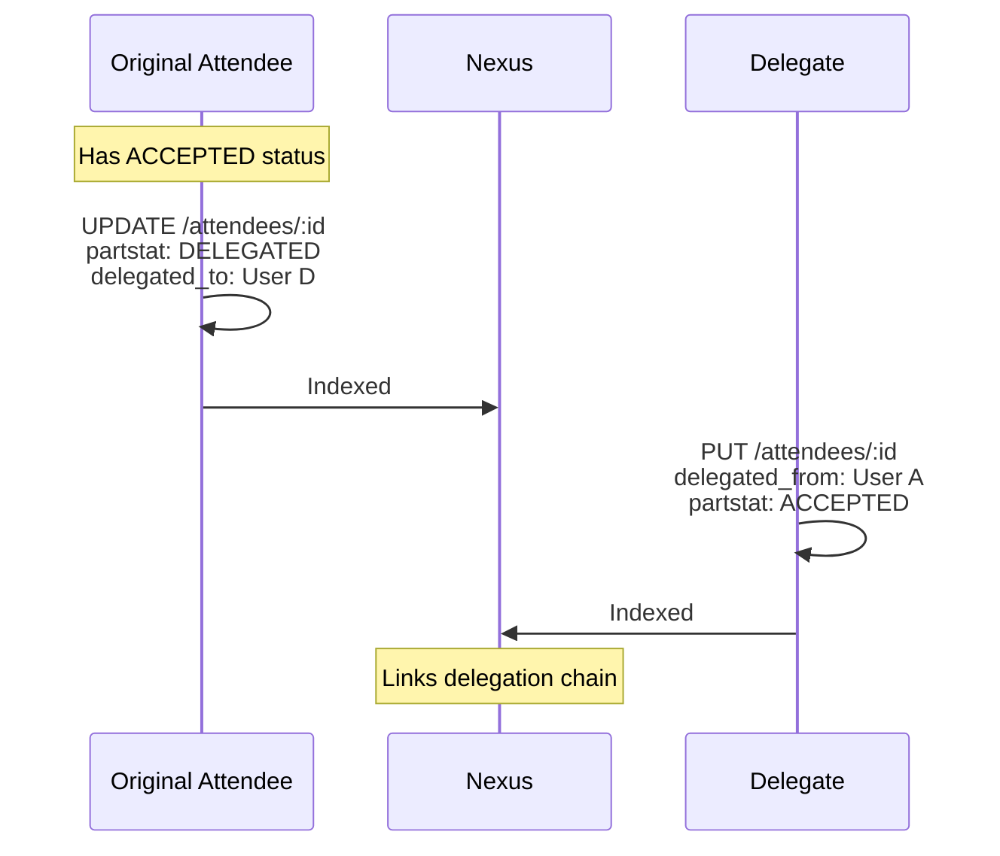

# Attendee Model Extensions

Future improvements to the attendee/RSVP system based on RFC 5545 ATTENDEE property.

## RFC 5545 Standard Properties

All of the following are **standard iCalendar properties** from RFC 5545, not custom extensions:

| Property | RFC Section | Values |
|----------|-------------|--------|
| `PARTSTAT` | 3.2.12 | NEEDS-ACTION, ACCEPTED, DECLINED, TENTATIVE, DELEGATED |
| `ROLE` | 3.2.16 | CHAIR, REQ-PARTICIPANT, OPT-PARTICIPANT, NON-PARTICIPANT |
| `CUTYPE` | 3.2.3 | INDIVIDUAL, GROUP, RESOURCE, ROOM, UNKNOWN |
| `RSVP` | 3.2.17 | TRUE, FALSE |
| `DELEGATED-TO` | 3.2.5 | URI of delegate |
| `DELEGATED-FROM` | 3.2.4 | URI of delegator |
| `MEMBER` | 3.2.11 | Group/mailing list URIs |
| `SENT-BY` | 3.2.18 | URI of sender (on behalf of) |
| `CN` | 3.2.2 | Common name (display name) |
| `DIR` | 3.2.6 | Directory entry URI |

These have been part of the iCalendar standard since 1998 (RFC 2445) and refined in RFC 5545 (2009).

---

## Current State

The current `PubkyAppAttendee` model supports basic self-RSVP:

```typescript
interface PubkyAppAttendee {
    x_pubky_event_uri: string;           // Event reference
    partstat: string;                    // NEEDS-ACTION | ACCEPTED | DECLINED | TENTATIVE
    recurrence_id?: string;              // For specific recurring instances
    created_at: number;
    last_modified?: number;
}
```

**Limitations:**
- Self-RSVP only (user creates their own attendance record)
- No organizer invitations
- No delegation
- No role differentiation
- No RSVP requests

---

## Proposed Extensions

### 1. Invitations (Organizer-Created Records) — *Pubky-specific*

Allow event organizers to create invitation records on their homeserver. This adapts the RFC 5545 ATTENDEE concept to Pubky's decentralized model where each user owns their own data.

```typescript
interface PubkyAppInvitation {
    // Identity
    x_pubky_event_uri: string;           // Event this invitation belongs to
    x_pubky_invitee_uri: string;         // User being invited (pubky://user_id)
    
    // RFC 5545 Properties
    role: "CHAIR" | "REQ-PARTICIPANT" | "OPT-PARTICIPANT" | "NON-PARTICIPANT";
    rsvp: boolean;                       // Whether response is requested
    
    // Metadata
    created_at: number;
    sent_at?: number;                    // When invitation was sent/published
    
    // Optional
    recurrence_id?: string;              // For specific instance
    comment?: string;                    // Invitation message
}
```

**Storage:** `/pub/eventky.app/invitations/:invitation_id`  
**ID:** Hash of `event_uri + invitee_uri + recurrence_id`

**Data Flow:**


---

### 2. Enhanced RSVP with Role & Delegation — *RFC 5545 Standard*

Extend `PubkyAppAttendee` with standard RFC 5545 properties:

```typescript
interface PubkyAppAttendee {
    // Current fields
    x_pubky_event_uri: string;
    partstat: "NEEDS-ACTION" | "ACCEPTED" | "DECLINED" | "TENTATIVE" | "DELEGATED";
    recurrence_id?: string;
    created_at: number;
    last_modified?: number;
    
    // NEW: Role (RFC 5545 3.2.16)
    role?: "CHAIR" | "REQ-PARTICIPANT" | "OPT-PARTICIPANT" | "NON-PARTICIPANT";
    
    // NEW: Delegation (RFC 5545 3.2.4, 3.2.5)
    delegated_to?: string;               // pubky://user_id we delegated to
    delegated_from?: string;             // pubky://user_id who delegated to us
    
    // NEW: Calendar User Type (RFC 5545 3.2.3)
    cutype?: "INDIVIDUAL" | "GROUP" | "RESOURCE" | "ROOM" | "UNKNOWN";
    
    // NEW: RSVP metadata
    rsvp_comment?: string;               // Comment with response
    rsvp_sent_at?: number;               // When response was sent
}
```

**Role Values (RFC 5545 3.2.16):**
| Role | Description |
|------|-------------|
| `CHAIR` | Event chair/organizer role |
| `REQ-PARTICIPANT` | Required attendee |
| `OPT-PARTICIPANT` | Optional attendee |
| `NON-PARTICIPANT` | For information only (no attendance expected) |

**CUTYPE Values (RFC 5545 3.2.3):**
| Type | Description |
|------|-------------|
| `INDIVIDUAL` | Person |
| `GROUP` | Group of people |
| `RESOURCE` | Physical resource (projector, etc.) |
| `ROOM` | Meeting room |
| `UNKNOWN` | Unknown type |

---

### 3. Delegation Flow — *RFC 5545 Standard*

Allow users to delegate attendance to others. This is a standard iCalendar workflow using `DELEGATED-TO` and `DELEGATED-FROM` parameters.



**Delegation Rules:**
1. Original attendee changes `partstat` to `DELEGATED`
2. Original attendee sets `delegated_to` to delegate's URI
3. Delegate creates new attendee record with `delegated_from`
4. Delegate sets their own `partstat`

---

### 4. Group RSVPs — *Requires Future Pubky Groups*

RFC 5545 defines `CUTYPE=GROUP` for group attendees:

> Example from RFC 5545: `ATTENDEE;CUTYPE=GROUP:mailto:ietf-calsch@example.org`

**Problem:** Pubky doesn't currently have a group/team primitive. The RFC assumes groups are mailing lists or directory entries, but we have no equivalent URI scheme for groups.

**Dependency:** This feature requires a future `PubkyAppGroup` or similar concept to be defined in pubky-app-specs first.

**Possible approaches (speculative):**
1. **Tag-based groups** — Use existing tags as pseudo-groups (`pubky://tag/team-engineering`)
2. **User-defined groups** — New record type where users define groups they own
3. **Follow lists as groups** — Repurpose follow lists for event invitations

Until Pubky has groups, we can only support `CUTYPE=INDIVIDUAL` (the default).

```typescript
// Future: If/when Pubky adds groups
interface PubkyAppGroupAttendee {
    x_pubky_event_uri: string;
    x_pubky_group_uri: string;           // TBD: What URI scheme?
    
    cutype: "GROUP";
    role: string;
    
    // Who responded on behalf of the group?
    responding_member?: string;          // pubky://user_id
    
    // Tracking
    expected_count?: number;
    confirmed_members?: string[];
}
```

---

### 5. Capacity & Waitlists — *Pubky Extension*

Support for events with limited capacity. This is **not part of RFC 5545** but a common real-world requirement.

```typescript
interface PubkyAppEvent {
    // ... existing fields ...
    
    // NEW: Capacity settings
    x_pubky_capacity?: {
        max_attendees?: number;
        waitlist_enabled?: boolean;
        max_waitlist?: number;
        auto_promote?: boolean;          // Auto-promote from waitlist when spot opens
    };
}

interface PubkyAppAttendee {
    // ... existing fields ...
    
    // NEW: Waitlist support
    waitlist_position?: number;          // Position in waitlist (if waitlisted)
    promoted_at?: number;                // When promoted from waitlist
}
```

**Waitlist Flow:**
1. User RSVPs when event is at capacity
2. `partstat: "TENTATIVE"` + `waitlist_position: N`
3. When spot opens, organizer promotes user
4. `partstat: "ACCEPTED"` + `promoted_at: timestamp`

---

### 6. Counter-Proposals (Alternative Times) — *RFC 5546 (iTIP)*

Allow attendees to propose alternative times. This is part of **RFC 5546 (iTIP)** which defines the `COUNTER` method for proposing changes.

```typescript
interface PubkyAppCounterProposal {
    x_pubky_event_uri: string;
    x_pubky_attendee_uri: string;        // Who is proposing
    
    // Proposed alternative
    proposed_dtstart: string;
    proposed_dtend?: string;
    proposed_location?: string;
    
    // Metadata
    reason?: string;
    created_at: number;
    status: "PENDING" | "ACCEPTED" | "DECLINED";
}
```

**Storage:** `/pub/eventky.app/counter-proposals/:proposal_id`

---

## Nexus Requirements

Each extension requires corresponding Nexus support:

| Feature | Nexus Endpoint | Query Support |
|---------|---------------|---------------|
| Invitations | `/v0/invitations/{userId}` | By event, by invitee |
| Delegation | `/v0/event/{id}/attendees` | Include delegation chain |
| Waitlist | `/v0/event/{id}/waitlist` | Ordered by position |
| Counter-proposals | `/v0/event/{id}/proposals` | By event |

---

## References

**RFC 5545 - iCalendar Core:**
- [Section 3.2.2 - CN (Common Name)](https://www.rfc-editor.org/rfc/rfc5545#section-3.2.2)
- [Section 3.2.3 - CUTYPE (Calendar User Type)](https://www.rfc-editor.org/rfc/rfc5545#section-3.2.3)
- [Section 3.2.4 - DELEGATED-FROM](https://www.rfc-editor.org/rfc/rfc5545#section-3.2.4)
- [Section 3.2.5 - DELEGATED-TO](https://www.rfc-editor.org/rfc/rfc5545#section-3.2.5)
- [Section 3.2.10 - MEMBER (Group Membership)](https://www.rfc-editor.org/rfc/rfc5545#section-3.2.11)
- [Section 3.2.12 - PARTSTAT](https://www.rfc-editor.org/rfc/rfc5545#section-3.2.12)
- [Section 3.2.16 - ROLE](https://www.rfc-editor.org/rfc/rfc5545#section-3.2.16)
- [Section 3.2.17 - RSVP](https://www.rfc-editor.org/rfc/rfc5545#section-3.2.17)
- [Section 3.8.4.1 - ATTENDEE Property](https://www.rfc-editor.org/rfc/rfc5545#section-3.8.4.1)

**RFC 5546 - iTIP (Transport-Independent Interoperability Protocol):**
- [COUNTER Method](https://www.rfc-editor.org/rfc/rfc5546#section-3.2.7) - For proposing alternative times
