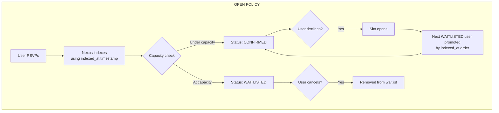
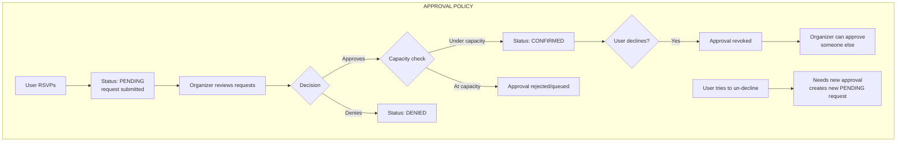
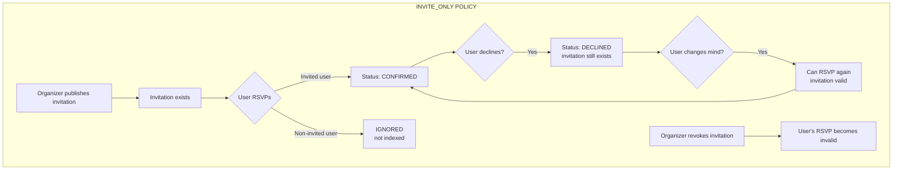
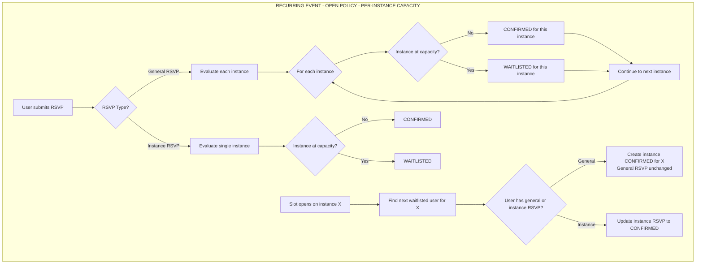
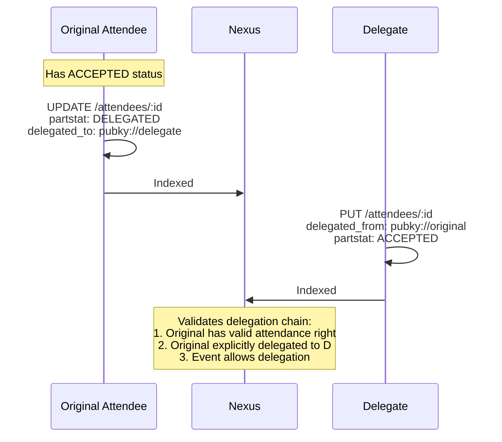

# Attendee Model Extensions

Future improvements to the attendee/RSVP system based on RFC 5545 ATTENDEE property.

---

## Table of Contents

1. [Trust & Validation Model](#trust--validation-model)
   - [Event Status & RSVP Interactions](#event-status--rsvp-interactions)
2. [Attendance Policies](#attendance-policies)
3. [Recurring Events & Capacity](#recurring-events--capacity)
   - [Handling rrule Changes](#handling-rrule-changes-single--recurring)
4. [Event Scenarios & Examples](#event-scenarios--examples)
5. [RFC 5545 Standard Properties](#rfc-5545-standard-properties)
6. [Current State](#current-state)
7. [Proposed Extensions](#proposed-extensions)
   - [Approvals & Denials](#3-approvals--denials-for-approval-policy--pubky-extension)
   - [Waitlist Promotion Modes](#9-waitlist-promotion-modes--pubky-extension)
8. [Nexus Requirements](#nexus-requirements)
9. [References](#references)

---

## Trust & Validation Model

### The Decentralization Challenge

In Pubky's decentralized architecture:
- **Users control their homeservers** and can write any data they want
- **Users can fake timestamps** in their `created_at` fields
- **Users can claim any role** (e.g., claim to be CHAIR when they're not)
- **Users can change their mind** at any time (RSVP → decline → RSVP again)
- **No central authority** exists to enforce rules at write-time

**Solution:** Validation happens at **read-time by Nexus**, not write-time. Nexus is the arbiter of truth for aggregated views.

### Authority Model

Different data has different authoritative sources:

| Data | Authoritative Source | Why |
|------|---------------------|-----|
| Event details | Event organizer | They own the event record |
| Attendance policy | Event organizer | Their event, their rules |
| Capacity limits | Event organizer | Their event, their rules |
| Invitations | Event organizer | They decide who to invite |
| Approvals | Event organizer | They decide who gets in |
| User's RSVP response | The user themselves | Self-sovereign identity |
| Delegation decisions | The delegating user | They choose to delegate |
| Waitlist position | **Nexus** (calculated) | Prevents timestamp manipulation |

### Timestamp Manipulation Prevention

**Critical Rule:** Nexus uses **its own indexing timestamp** for ordering, not user-provided `created_at`.

```typescript
// What user writes to homeserver (can be faked):
{ 
    partstat: "ACCEPTED",
    created_at: 1609459200000  // Claims Jan 1, 2021
}

// What Nexus stores internally:
{ 
    partstat: "ACCEPTED",
    user_created_at: 1609459200000,  // User's claim (informational only)
    indexed_at: 1706367600000        // When Nexus saw it (AUTHORITATIVE)
}
```

**Implications:**
- Waitlist position is based on `indexed_at`, not `created_at`
- First-come-first-served uses `indexed_at`
- User's `created_at` is preserved for display but not trusted for ordering

### Role & CUTYPE Validation

**Problem:** A user could claim `role: "CHAIR"` or `cutype: "ROOM"` when they shouldn't.

**Solution:** Nexus handles roles differently depending on the policy:

| Context | Role Source | Behavior |
|---------|-------------|----------|
| `INVITE_ONLY` events | Organizer's invitation | User's self-claimed role ignored |
| `APPROVAL` events | Organizer's approval | User's self-claimed role ignored |
| `OPEN` events | User self-declares (optional) | Stored and displayed, but not authoritative |
| Organizer themselves | Implicit | Always `CHAIR` for their own events |

#### Roles in OPEN Events

For `OPEN` policy events, users may optionally self-declare a role in their RSVP:

```typescript
// User RSVPs with self-declared role
{
    x_pubky_event_uri: "pubky://org/events/meetup",
    partstat: "ACCEPTED",
    self_declared_role?: "SPEAKER" | "VOLUNTEER" | "ATTENDEE"  // Optional
}
```

**Considerations:**

| Approach | Behavior | Tradeoff |
|----------|----------|----------|
| **Ignore user roles** | Nexus doesn't index role field for OPEN events | Simplest, but loses useful context |
| **Store but don't trust** | Role stored and displayed with "self-declared" indicator | Useful for context, clearly non-authoritative |
| **Custom role vocabulary** | Define event-specific roles organizer can enable | More complex, requires event schema extension |

**Recommendation:** Store self-declared roles for OPEN events with a clear distinction:
- Display with "self-declared" badge in UI
- Organizer can see who claims what (e.g., "10 attendees, 2 self-declared speakers")
- No enforcement or validation (anyone can claim any role)
- Useful for community events where people self-organize

**Note:** The standard RFC 5545 `ROLE` values (`CHAIR`, `REQ-PARTICIPANT`, `OPT-PARTICIPANT`, `NON-PARTICIPANT`) are designed for organizer-assigned roles. For self-declared roles in OPEN events, consider a separate field or extended vocabulary.

**CUTYPE:** Currently only `INDIVIDUAL` is supported. Other values (`GROUP`, `ROOM`, `RESOURCE`) are ignored until Pubky has those primitives.

### Invalid Data Handling

When Nexus encounters invalid or unauthorized data:

| Scenario | Nexus Behavior |
|----------|----------------|
| RSVP to non-existent event | Ignored (not indexed) |
| RSVP to `INVITE_ONLY` without invitation | Ignored |
| RSVP to `APPROVAL` without approval | Indexed as `PENDING` |
| Claiming `CHAIR` role on someone else's event | Role field ignored |
| Invitation from non-organizer | Ignored |
| Approval from non-organizer | Ignored |
| Delegation without delegator's consent | Ignored |
| RSVP when at capacity (OPEN event) | Indexed as `WAITLISTED` |

### Event Status & RSVP Interactions

RFC 5545 events have a `status` field: `CONFIRMED`, `TENTATIVE`, or `CANCELLED`. This affects RSVP behavior:

| Event Status | RSVP Allowed? | RSVP Behavior |
|--------------|---------------|---------------|
| `CONFIRMED` | Yes | Normal RSVP flow |
| `TENTATIVE` | Yes | RSVPs accepted, UI should indicate event is tentative |
| `CANCELLED` | Configurable | See options below |

#### Cancelled Event Options

| Approach | Behavior | Tradeoff |
|----------|----------|----------|
| **Block new RSVPs** | Nexus ignores RSVPs to CANCELLED events | Prevents confusion, but prevents "interested if rescheduled" |
| **Allow RSVPs with warning** | RSVPs indexed, computed status includes `CANCELLED_EVENT` flag | Flexible, but may confuse users |
| **Preserve existing, block new** | Existing RSVPs remain, new ones ignored | Balanced approach |

**Recommendation:** Preserve existing RSVPs when an event is cancelled (don't auto-delete), but block new RSVPs. Existing attendees should see "Event Cancelled" in their RSVP list. This allows organizers to communicate with people who had already RSVP'd.

#### RSVP State Transitions

Users can change their RSVP status over time. Valid transitions:

```
NEEDS-ACTION ─┬─► ACCEPTED ─┬─► DECLINED ─┬─► ACCEPTED (re-RSVP)
              │             │             │
              ├─► DECLINED  └─► TENTATIVE └─► TENTATIVE
              │
              └─► TENTATIVE ─► ACCEPTED/DECLINED
```

**Key Rules:**
- `NEEDS-ACTION` is the implicit state (no RSVP record exists)
- Users can always change from ACCEPTED → DECLINED → ACCEPTED (for OPEN/INVITE_ONLY)
- For `APPROVAL` policy, re-RSVPing after decline requires new approval
- `TENTATIVE` is a valid intermediate state ("maybe attending")
- `DELEGATED` is a terminal state (can only be undone by canceling delegation)

---

## Attendance Policies

Events declare their attendance policy. Nexus enforces it.

### Policy Types

```typescript
interface PubkyAppEvent {
    // ... existing fields ...
    
    x_pubky_attendance?: {
        policy: "OPEN" | "APPROVAL" | "INVITE_ONLY";
        capacity?: number;              // Max attendees (null = unlimited)
        waitlist_enabled?: boolean;     // Allow waitlist when full
        waitlist_mode?: "FIFO" | "ORGANIZER_CONTROLLED";  // Default: "FIFO"
        max_waitlist?: number;          // Max waitlist size (null = unlimited)
        allow_plus_ones?: boolean;      // Allow +1 guests
        max_plus_ones?: number;         // Max +1 per attendee
        delegation_allowed?: boolean;   // Allow delegation (default: true)
    };
}
```

### Policy Comparison

| Policy | Who Can RSVP | Capacity Enforcement | Organizer Action Required |
|--------|--------------|---------------------|---------------------------|
| `OPEN` | Anyone | First-indexed-first-served | None |
| `APPROVAL` | Anyone can request | Organizer approves up to capacity | Publish approvals |
| `INVITE_ONLY` | Only invited users | Implicit (invite = slot reserved) | Publish invitations |

### State Machines

#### OPEN Policy



#### APPROVAL Policy



#### INVITE_ONLY Policy



---

## Recurring Events & Capacity

Recurring events introduce complexity around attendance tracking because users can RSVP to:
1. **The entire series** (general RSVP, `recurrence_id: null`)
2. **Specific instances** (instance RSVP, `recurrence_id: "2025-01-15T10:00:00"`)

### RSVP Types for Recurring Events

| RSVP Type | `recurrence_id` | Meaning |
|-----------|-----------------|---------|
| General RSVP | `null` / omitted | "I'm attending all instances" |
| Instance RSVP | ISO datetime | "I'm attending this specific instance" |

### Priority Rules (Existing)

Instance-specific RSVPs override general RSVPs:

```
For instance "2025-01-15T10:00:00":
1. Check for RSVP with recurrence_id = "2025-01-15T10:00:00" → Use if exists
2. Check for RSVP with recurrence_id = null → Use as fallback
3. No RSVP → NEEDS-ACTION
```

### Capacity Counting for Recurring Events

**Key Question:** How does Nexus count capacity when users have mixed RSVP types?

#### Option A: Per-Instance Capacity (Recommended)

Each instance has its own capacity pool. General RSVPs count toward ALL instances.

```typescript
// Event: Weekly meetup, capacity 20 per instance
{
    rrule: "FREQ=WEEKLY;BYDAY=WED",
    x_pubky_attendance: {
        policy: "OPEN",
        capacity: 20,              // Per instance
        capacity_scope: "INSTANCE" // Default for recurring events
    }
}
```

**Counting Logic:**
```
For instance "2025-01-15":
  confirmed_count = 
    users with instance RSVP (recurrence_id = "2025-01-15", partstat = ACCEPTED)
    + users with general RSVP (recurrence_id = null, partstat = ACCEPTED)
    - users with instance override (recurrence_id = "2025-01-15", partstat = DECLINED)
```

**Example:**
```
General RSVPs (recurrence_id: null, ACCEPTED): Alice, Bob, Charlie (3)
Instance RSVPs for Jan 15:
  - David: ACCEPTED
  - Alice: DECLINED (overrides her general ACCEPTED)

Jan 15 count: Bob + Charlie + David = 3 confirmed
Jan 22 count: Alice + Bob + Charlie = 3 confirmed
```

#### Option B: Series-Wide Capacity

Total unique attendees across all instances is capped.

```typescript
{
    rrule: "FREQ=WEEKLY;COUNT=10",
    x_pubky_attendance: {
        policy: "OPEN",
        capacity: 50,             // Total unique attendees
        capacity_scope: "SERIES"  // Counts unique users, not per-instance
    }
}
```

**Use Case:** Workshop series where the same 50 people attend all sessions.

### Waitlist Behavior for Recurring Events

#### Per-Instance Waitlist (Default)

When `capacity_scope: "INSTANCE"`:

| Scenario | Behavior |
|----------|----------|
| User submits general RSVP, instance X is at capacity | User is CONFIRMED for other instances, WAITLISTED for instance X |
| User submits instance RSVP, that instance is at capacity | User is WAITLISTED for that instance only |
| Slot opens on instance X | Next waitlisted user for instance X is promoted |
| User with general RSVP is promoted on instance X | Creates implicit instance RSVP (CONFIRMED) for X |

**Computed Status per Instance:**
```typescript
interface InstanceAttendanceStatus {
    instance_date: string;           // "2025-01-15T10:00:00"
    computed_status: ComputedAttendanceStatus;
    waitlist_position?: number;      // If waitlisted for this instance
    rsvp_source: "INSTANCE" | "GENERAL";  // Which RSVP determined this status
}
```

#### General RSVP + Full Instance Edge Cases

| Scenario | Outcome |
|----------|---------|
| User has general ACCEPTED, instance X is full | WAITLISTED for X, CONFIRMED for others |
| User with general RSVP declines instance X | Instance DECLINED overrides, no waitlist involvement |
| User with general WAITLISTED, instance Y has space | CONFIRMED for Y (general RSVP applies where capacity allows) |
| User #5 (general RSVP) is promoted on instance X | Gets instance-specific CONFIRMED for X, general RSVP still applies elsewhere |

### State Machine: Recurring Event with Capacity



### Nexus Response for Recurring Events

```typescript
interface RecurringEventAttendanceResponse {
    policy: "OPEN" | "APPROVAL" | "INVITE_ONLY";
    capacity: number | null;
    capacity_scope: "INSTANCE" | "SERIES";
    
    // Aggregated counts (across all instances)
    total_unique_attendees: number;
    
    // Per-instance breakdown (for next N occurrences)
    instances: Array<{
        instance_date: string;
        counts: {
            confirmed: number;
            tentative: number;
            waitlisted: number;
            declined: number;
        };
        at_capacity: boolean;
    }>;
    
    // Current user's status per instance (if authenticated)
    user_instance_statuses?: InstanceAttendanceStatus[];
}
```

### UI Considerations

1. **Series View:** Show aggregated attendance ("15 people attending this series")
2. **Instance View:** Show instance-specific counts ("12/20 for Jan 15")
3. **User's Calendar:** Show per-instance status with visual indicators
4. **RSVP Action:**
   - Default: General RSVP ("Attend all")
   - Option: Instance RSVP ("Just this one")
   - Clear indication when some instances are waitlisted

### Handling rrule Changes (Single ↔ Recurring)

When an organizer edits an event to add, remove, or modify the `rrule`, existing RSVPs need special handling.

#### Scenario: Single Event → Recurring Event

**Problem:** Users RSVPed to a single event (Jan 15). Organizer adds `rrule: "FREQ=WEEKLY"`. Without intervention, their `recurrence_id: null` RSVPs would apply to ALL future instances—but they only signed up for one date.

**Approaches:**

| Approach | Behavior | Tradeoff |
|----------|----------|----------|
| **Pin to original date** (Recommended) | Convert `recurrence_id: null` → `recurrence_id: "2025-01-15T10:00:00"` | Preserves user intent; requires Nexus migration |
| **Keep as general** | RSVPs apply to all instances | Unexpected for users; may over-commit them |
| **Invalidate RSVPs** | Existing RSVPs become invalid; users must re-RSVP | Disruptive; loses attendance data |

**Recommended Implementation:**

When Nexus detects an event gained an `rrule` (previously `null`):
1. Find all attendee records with `recurrence_id: null`
2. Treat them as if `recurrence_id` equals the original `dtstart`
3. This is a **read-time interpretation**, not a write to user data

```typescript
// Nexus computed field
interface NexusAttendeeComputed {
    // ... existing fields ...
    
    effective_recurrence_id: string | null;
    // If event.rrule was added after RSVP:
    //   null → event.original_dtstart (pinned to original date)
    // Otherwise: actual recurrence_id from record
}
```

#### Scenario: Recurring Event → Single Event

**Problem:** Users have RSVPs for various instances. Organizer removes `rrule`. Event is now just one date.

**Approaches:**

| Approach | Behavior | Tradeoff |
|----------|----------|----------|
| **Keep matching RSVPs** (Recommended) | Only RSVPs for remaining date (or general) are valid | Clean; orphaned RSVPs hidden |
| **Convert all to general** | All RSVPs become `recurrence_id: null` | May include users who declined the remaining date |
| **Invalidate all** | All RSVPs invalid | Disruptive |

**Recommended Implementation:**

When Nexus detects an event lost its `rrule`:
1. General RSVPs (`recurrence_id: null`) remain valid
2. Instance RSVPs matching the remaining `dtstart` remain valid
3. Other instance RSVPs become orphaned (hidden in UI, preserved in data)

#### Scenario: rrule Modified (Different Pattern)

**Problem:** Event was `FREQ=WEEKLY;BYDAY=MON`, changed to `FREQ=WEEKLY;BYDAY=WED`. Instance dates shift.

**Approaches:**

| Approach | Behavior | Tradeoff |
|----------|----------|----------|
| **Orphan mismatched** (Recommended) | RSVPs for old dates hidden; general RSVPs apply to new dates | Predictable; users re-RSVP for new dates |
| **Attempt date mapping** | Try to map old instances to new instances | Complex; may map incorrectly |

**Edge Cases: rrule Changes**

| Scenario | Outcome |
|----------|---------|
| Single → Recurring: User had general RSVP | Pinned to original `dtstart` only |
| Single → Recurring: Capacity was 20, now per-instance | Original attendees confirmed for original date; new instances start empty |
| Recurring → Single: User had general RSVP | Still valid for remaining date |
| Recurring → Single: User had instance RSVP for removed date | Orphaned (hidden) |
| Recurring → Single: User had instance RSVP for kept date | Still valid |
| rrule pattern change: User had general RSVP | Applies to new pattern's instances |
| rrule pattern change: User had instance RSVP | Orphaned if date no longer exists |
| rrule COUNT reduced (10→5): User had instance RSVP for instance 7 | Orphaned |

#### Nexus Tracking for rrule Changes

To implement "pin to original date" correctly, Nexus needs to track:

```typescript
interface NexusEventMeta {
    // ... existing fields ...
    
    rrule_history?: Array<{
        changed_at: number;        // When rrule changed
        previous_rrule: string | null;
        previous_dtstart: string;  // For pinning RSVPs
    }>;
}
```

**Note:** This is a Nexus-side concern. User homeserver data is immutable—we don't rewrite their RSVP records.

### Edge Cases Table: Recurring Events

| Scenario | Outcome |
|----------|---------|
| User submits general RSVP, 3 of 10 instances at capacity | CONFIRMED for 7, WAITLISTED for 3 |
| Waitlisted user (general) gets promoted on instance X | Instance X: CONFIRMED, others: unchanged |
| User with general ACCEPTED submits instance DECLINED for X | X: DECLINED, others: still ACCEPTED |
| User with general WAITLISTED, instance Y opens | Y: CONFIRMED (promoted), others: still WAITLISTED where full |
| User declines general RSVP | All instances become DECLINED (unless instance overrides exist) |
| User with instance CONFIRMED for X submits general DECLINED | X: still CONFIRMED (instance takes priority), others: DECLINED |
| Event rrule changes, removes instance X | RSVPs for X become orphaned (hidden in UI, preserved in data) |
| Capacity increased from 20 to 30 | Waitlisted users auto-promoted up to new capacity |

---

## Event Scenarios & Examples

### Scenario 1: Open Community Meetup (Unlimited)

**Event Type:** Weekly Bitcoin meetup at a bar  
**Policy:** `OPEN`, no capacity limit

```typescript
{
    summary: "Weekly Bitcoin Meetup",
    x_pubky_attendance: {
        policy: "OPEN"
        // No capacity = unlimited
    }
}
```

**Behavior:**
- Anyone can RSVP
- All RSVPs are immediately `CONFIRMED`
- Organizer can see attendee list
- No waitlist needed

---

### Scenario 2: Workshop with Limited Seats

**Event Type:** Hands-on coding workshop  
**Policy:** `OPEN` with capacity 20

```typescript
{
    summary: "Rust Workshop",
    x_pubky_attendance: {
        policy: "OPEN",
        capacity: 20,
        waitlist_enabled: true,
        max_waitlist: 50
    }
}
```

**Behavior:**
- First 20 RSVPs (by `indexed_at`) are `CONFIRMED`
- RSVPs 21-70 are `WAITLISTED` with position
- RSVPs 71+ are rejected (waitlist full)
- When someone declines, next waitlisted is auto-promoted

**Edge Cases:**
| Scenario | Outcome |
|----------|---------|
| User #5 declines | Users #6-20 stay confirmed, #21 promoted to confirmed |
| User #21 (just promoted) declines | #22 promoted |
| User #5 declines then accepts again | Goes to end of waitlist (new `indexed_at`); doesn't reclaim original spot |
| Confirmed user tries to RSVP again | No change (already confirmed) |
| Waitlisted user tries to RSVP again | No change (position preserved) |
| User fakes early timestamp | Ignored; `indexed_at` determines position |

---

### Scenario 3: Private Dinner Party

**Event Type:** Intimate gathering at organizer's home  
**Policy:** `INVITE_ONLY`

```typescript
{
    summary: "Birthday Dinner",
    x_pubky_attendance: {
        policy: "INVITE_ONLY",
        capacity: 12,
        allow_plus_ones: true,
        max_plus_ones: 1
    }
}
```

**Organizer Actions:**
1. Creates event
2. Publishes invitations for specific users
3. Each invitation can specify role (e.g., `REQ-PARTICIPANT`)

**Behavior:**
- Only invited users can RSVP
- Uninvited RSVPs are ignored by Nexus
- Invited users can bring +1 (if allowed)
- Organizer can revoke invitations

**Edge Cases:**
| Scenario | Outcome |
|----------|---------|
| Uninvited user RSVPs | Ignored by Nexus |
| Invited user declines | Status: DECLINED, can change mind later |
| Invited user was declined, tries again | Can RSVP (invitation still valid) |
| Organizer revokes invitation after RSVP | RSVP becomes invalid, user notified |
| User invites themselves (writes invitation) | Ignored (only organizer can invite) |

---

### Scenario 4: Conference Talk (Approval-Based)

**Event Type:** Conference session requiring pre-registration  
**Policy:** `APPROVAL` with capacity

```typescript
{
    summary: "Advanced Cryptography Talk",
    x_pubky_attendance: {
        policy: "APPROVAL",
        capacity: 100,
        waitlist_enabled: true
    }
}
```

**Flow:**
1. Users RSVP → Status: `PENDING`
2. Organizer reviews requests
3. Organizer approves/denies each request
4. Approved users (up to 100) become `CONFIRMED`
5. Additional approvals when over capacity go to internal queue

**Edge Cases:**
| Scenario | Outcome |
|----------|---------|
| 100 approved, organizer approves #101 | Nexus rejects (at capacity) OR queues for when slot opens |
| Approved user declines | Slot opens, organizer can approve from pending |
| User approved then declines then wants back in | Must request again (new PENDING), needs re-approval |
| User tries to approve themselves | Ignored (only organizer can approve) |

---

### Scenario 5: Ticketed Concert (External Ticketing)

**Event Type:** Paid event with external ticket system  
**Policy:** `INVITE_ONLY` (invitations represent tickets)

```typescript
{
    summary: "Bitcoin Conference 2026",
    x_pubky_attendance: {
        policy: "INVITE_ONLY",
        capacity: 5000
    },
    x_pubky_ticketing: {
        external_url: "https://tickets.example.com/btc2026",
        price: "0.001 BTC"
    }
}
```

**Flow:**
1. User purchases ticket externally
2. External system notifies organizer
3. Organizer publishes invitation for ticket holder
4. User RSVPs to confirm attendance

**Note:** Ticketing integration is out of scope for this spec but the model supports it.

---

### Scenario 6: Recurring Office Hours (Rolling Capacity)

**Event Type:** Weekly 1-on-1 slots  
**Policy:** `APPROVAL` per instance

```typescript
{
    summary: "Office Hours with Alice",
    rrule: "FREQ=WEEKLY;BYDAY=TU",
    x_pubky_attendance: {
        policy: "APPROVAL",
        capacity: 1  // One person per instance
    }
}
```

**Behavior:**
- Each recurrence instance has independent attendance
- User RSVPs to specific instance (via `recurrence_id`)
- Organizer approves one person per week
- Same user can be approved for multiple weeks

---

### Scenario 7: Team Meeting (Role-Based)

**Event Type:** Project sync with different participant roles  
**Policy:** `INVITE_ONLY` with roles

```typescript
{
    summary: "Project Alpha Weekly Sync",
    x_pubky_attendance: {
        policy: "INVITE_ONLY",
        delegation_allowed: true
    }
}
```

**Organizer publishes invitations with roles:**
```typescript
// Invitation for project lead
{
    x_pubky_event_uri: "pubky://org/events/alpha-sync",
    x_pubky_invitee_uri: "pubky://alice",
    role: "CHAIR"
}

// Invitation for required team member
{
    x_pubky_event_uri: "pubky://org/events/alpha-sync",
    x_pubky_invitee_uri: "pubky://bob",
    role: "REQ-PARTICIPANT"
}

// Invitation for optional stakeholder
{
    x_pubky_event_uri: "pubky://org/events/alpha-sync",
    x_pubky_invitee_uri: "pubky://charlie",
    role: "OPT-PARTICIPANT"
}
```

**Delegation allowed:** Bob can delegate to a teammate if he can't attend.

---

### Scenario 8: Conference with Waitlist Promotion (FIFO)

**Event Type:** Popular workshop that fills up  
**Policy:** `OPEN` with waitlist

```typescript
{
    summary: "Intro to Nostr",
    x_pubky_attendance: {
        policy: "OPEN",
        capacity: 30,
        waitlist_enabled: true,
        max_waitlist: 100
    }
}
```

**Timeline Example:**
```
T+0:    Event published
T+1min: 30 RSVPs arrive, all CONFIRMED
T+2min: 20 more RSVPs, all WAITLISTED (positions 1-20)
T+1hr:  User #15 (confirmed) declines
        → User at waitlist position 1 auto-promoted to CONFIRMED
        → All waitlist positions shift down
T+2hr:  User #8 (confirmed) declines
        → User at waitlist position 1 (was position 2) promoted
```

**Waitlist Position Calculation:**
- Based on `indexed_at` timestamp (Nexus's clock)
- Positions are relative, not absolute (no gaps)
- Recalculated on any change

---

### Scenario 9: Organizer-Controlled Waitlist Promotion

**Event Type:** Curated workshop where the organizer wants control over who gets promoted  
**Policy:** `OPEN` with organizer-controlled waitlist

```typescript
{
    summary: "Advanced Bitcoin Development Workshop",
    x_pubky_attendance: {
        policy: "OPEN",
        capacity: 20,
        waitlist_enabled: true,
        waitlist_mode: "ORGANIZER_CONTROLLED"  // vs "FIFO"
    }
}
```

**Flow:**
1. Event fills to capacity (20 confirmed)
2. Additional RSVPs go to waitlist
3. User #5 declines → slot opens
4. **Unlike FIFO:** Nexus does NOT auto-promote
5. Organizer reviews waitlist and publishes a promotion record for their preferred candidate
6. Promoted user becomes CONFIRMED

**Organizer Promotion Record:**
```typescript
// Organizer publishes this to promote a waitlisted user
{
    x_pubky_event_uri: "pubky://org/events/btc-workshop",
    x_pubky_attendee_uri: "pubky://waitlisted_user",
    promoted_at: 1706367600000,
    recurrence_id?: string  // For specific recurring instance
}
```

**Use Cases:**
- VIP/speaker prioritization
- Skill-based selection (workshop prerequisites)
- Sponsor/partner allocations
- Balancing attendee demographics

---

### Scenario 10: Delegation Chain

**Event Type:** Corporate meeting where attendance can be delegated  
**Policy:** `INVITE_ONLY` with delegation

```typescript
{
    summary: "Q4 Planning",
    x_pubky_attendance: {
        policy: "INVITE_ONLY",
        delegation_allowed: true
    }
}
```

**Delegation Flow:**
```
1. Alice is invited (CHAIR)
2. Alice RSVPs: ACCEPTED
3. Alice can't attend, delegates to Bob:
   - Alice updates: partstat: DELEGATED, delegated_to: pubky://bob
4. Bob creates attendee record:
   - partstat: ACCEPTED, delegated_from: pubky://alice
5. Nexus validates:
   - Alice has valid invitation
   - Alice explicitly delegated to Bob
   - Bob's delegation claim matches Alice's record
6. Bob is now the attendee (with Alice's role inherited)
```

**Invalid Delegation (Nexus Ignores):**
- Bob claims delegation but Alice didn't delegate
- Bob delegates Alice's invitation to Carol (can't re-delegate)
- Delegation when `delegation_allowed: false`

---

### Scenario 11: Event with Plus-Ones

**Event Type:** Wedding  
**Policy:** `INVITE_ONLY` with +1

```typescript
{
    summary: "Sarah & Mike's Wedding",
    x_pubky_attendance: {
        policy: "INVITE_ONLY",
        capacity: 150,
        allow_plus_ones: true,
        max_plus_ones: 1
    }
}
```

**Plus-One Handling:**
```typescript
// User's RSVP with plus-one
{
    x_pubky_event_uri: "pubky://sarah/events/wedding",
    partstat: "ACCEPTED",
    plus_ones: 1,                    // Bringing 1 guest
    plus_one_names: ["John Doe"]     // Optional: guest name
}
```

**Capacity Calculation:**
- Nexus counts: confirmed attendees + their plus_ones
- If at 148/150 and someone with +1 RSVPs → would be 150/150 (allowed)
- If at 149/150 and someone with +1 RSVPs → exceeds capacity (waitlisted or rejected based on policy)

---

## RFC 5545 Standard Properties

All of the following are **standard iCalendar properties** from RFC 5545, not custom extensions:

| Property | RFC Section | Values | Supported |
|----------|-------------|--------|-----------|
| `PARTSTAT` | 3.2.12 | NEEDS-ACTION, ACCEPTED, DECLINED, TENTATIVE, DELEGATED | ✅ Yes |
| `ROLE` | 3.2.16 | CHAIR, REQ-PARTICIPANT, OPT-PARTICIPANT, NON-PARTICIPANT | ✅ Yes |
| `CUTYPE` | 3.2.3 | INDIVIDUAL, GROUP, RESOURCE, ROOM, UNKNOWN | ⚠️ INDIVIDUAL only |
| `RSVP` | 3.2.17 | TRUE, FALSE | ✅ Yes |
| `DELEGATED-TO` | 3.2.5 | URI of delegate | ✅ Yes |
| `DELEGATED-FROM` | 3.2.4 | URI of delegator | ✅ Yes |
| `MEMBER` | 3.2.11 | Group/mailing list URIs | ❌ Blocked (no groups) |
| `SENT-BY` | 3.2.18 | URI of sender (on behalf of) | ⚠️ Future |
| `CN` | 3.2.2 | Common name (display name) | ✅ Via user profile |
| `DIR` | 3.2.6 | Directory entry URI | ❌ N/A |

These have been part of the iCalendar standard since 1998 (RFC 2445) and refined in RFC 5545 (2009).

---

## Current State

The current `PubkyAppAttendee` model supports basic self-RSVP:

```typescript
interface PubkyAppAttendee {
    x_pubky_event_uri: string;           // Event reference
    partstat: string;                    // NEEDS-ACTION | ACCEPTED | DECLINED | TENTATIVE
    recurrence_id?: string;              // For specific recurring instances
    created_at: number;
    last_modified?: number;
}
```

**Limitations:**
- Self-RSVP only (user creates their own attendance record)
- No attendance policies
- No organizer invitations/approvals
- No delegation
- No role differentiation
- No capacity management

---

## Proposed Extensions

### 1. Attendance Policy on Events — *Pubky Extension*

Add attendance settings to the event model:

```typescript
interface PubkyAppEvent {
    // ... existing fields ...
    
    x_pubky_attendance?: {
        policy: "OPEN" | "APPROVAL" | "INVITE_ONLY";
        capacity?: number;
        waitlist_enabled?: boolean;
        waitlist_mode?: "FIFO" | "ORGANIZER_CONTROLLED";  // Default: "FIFO"
        max_waitlist?: number;
        allow_plus_ones?: boolean;
        max_plus_ones?: number;
        delegation_allowed?: boolean;    // Default: true
        count_tentative_toward_capacity?: boolean;  // Default: true
    };
}
```

**Default Behavior (no `x_pubky_attendance`):**
- Policy: `OPEN`
- Capacity: unlimited
- Waitlist mode: `FIFO`
- Delegation: allowed
- Tentative counts toward capacity: yes

---

### 2. Invitations (Organizer-Created) — *Pubky Extension*

For `INVITE_ONLY` events, organizers publish invitation records:

```typescript
interface PubkyAppInvitation {
    x_pubky_event_uri: string;           // Event this invitation belongs to
    x_pubky_invitee_uri: string;         // User being invited (pubky://user_id)
    
    // RFC 5545 Properties
    role: "CHAIR" | "REQ-PARTICIPANT" | "OPT-PARTICIPANT" | "NON-PARTICIPANT";
    
    // Metadata
    created_at: number;
    revoked_at?: number;                 // If organizer revokes invitation
    
    // Optional
    recurrence_id?: string;              // For specific instance of recurring event
    comment?: string;                    // Invitation message
}
```

**Storage:** `/pub/eventky.app/invitations/:invitation_id`  
**ID:** Hash of `event_uri + invitee_uri + recurrence_id`

**Validation Rules:**
- Only indexed if the invitation's author is the event's organizer
- If `revoked_at` is set, invitation is no longer valid
- Role from invitation is authoritative (user can't override)

---

### 3. Approvals & Denials (For APPROVAL Policy) — *Pubky Extension*

For `APPROVAL` events, organizers publish approval or denial records:

```typescript
interface PubkyAppAttendeeApproval {
    x_pubky_event_uri: string;
    x_pubky_attendee_uri: string;        // Who is approved/denied
    
    // Status (exactly one of these should be set)
    approved_at?: number;                // When approved
    denied_at?: number;                  // When denied (explicit rejection)
    revoked_at?: number;                 // When approval was revoked (after being approved)
    
    // Optional
    recurrence_id?: string;
    role?: "CHAIR" | "REQ-PARTICIPANT" | "OPT-PARTICIPANT" | "NON-PARTICIPANT";
    comment?: string;                    // Message to attendee (approval or denial reason)
}
```

**Storage:** `/pub/eventky.app/approvals/:approval_id`  
**ID:** Hash of `event_uri + attendee_uri + recurrence_id`

**Status Logic:**
- `approved_at` set, others null → User is APPROVED
- `denied_at` set → User is DENIED (explicit rejection)
- `revoked_at` set (after `approved_at`) → User was approved then revoked
- None set → Record is invalid

**Validation Rules:**
- Only indexed if author is event organizer
- `denied_at` is a definitive rejection (user sees "Request Denied")
- `revoked_at` only valid if `approved_at` was previously set
- Organizer can update the record to change status (e.g., deny → approve later)

**DENIED vs No Response:**

| State | Meaning | User Experience |
|-------|---------|-----------------|
| No approval record | Pending (awaiting review) | "Awaiting organizer approval" |
| `denied_at` set | Explicitly rejected | "Your request was denied" |
| `approved_at` set | Approved | "You're confirmed!" |
| `revoked_at` set | Was approved, now revoked | "Your approval was revoked" |

---

### 4. Enhanced Attendee Record — *RFC 5545 + Pubky*

Extend the attendee record with delegation and plus-one support:

```typescript
interface PubkyAppAttendee {
    // Current fields
    x_pubky_event_uri: string;
    partstat: "NEEDS-ACTION" | "ACCEPTED" | "DECLINED" | "TENTATIVE" | "DELEGATED";
    recurrence_id?: string;
    created_at: number;
    last_modified?: number;
    
    // Delegation (RFC 5545 3.2.4, 3.2.5)
    delegated_to?: string;               // pubky://user_id we delegated to
    delegated_from?: string;             // pubky://user_id who delegated to us
    
    // Plus-ones (Pubky extension)
    plus_ones?: number;                  // Number of guests (0 = none)
    plus_one_names?: string[];           // Optional guest names
    
    // RSVP metadata
    rsvp_comment?: string;               // Comment with response
}
```

**Note:** `role` is NOT in the attendee record. It comes from:
- The organizer's invitation (INVITE_ONLY)
- The organizer's approval (APPROVAL)
- Not applicable (OPEN events)

---

### 5. Delegation Flow — *RFC 5545 Standard*

Allow users to delegate attendance to others:



**Delegation Rules:**
1. Event must have `delegation_allowed: true` (default)
2. Original attendee must have valid attendance (invitation/approval/RSVP)
3. Original sets `partstat: DELEGATED` and `delegated_to`
4. Delegate creates record with `delegated_from`
5. Nexus validates both sides match
6. Delegate inherits original's role
7. Re-delegation (delegate delegates again) is NOT allowed

---

### 6. Computed Attendance Status — *Nexus*

Nexus computes a unified status for each attendee:

```typescript
type ComputedAttendanceStatus = 
    | "CONFIRMED"      // Has valid right to attend (ACCEPTED)
    | "TENTATIVE"      // User indicated tentative attendance
    | "PENDING"        // Awaiting approval (APPROVAL policy)
    | "WAITLISTED"     // At capacity, in queue
    | "DECLINED"       // User declined
    | "DENIED"         // Organizer denied (APPROVAL policy)
    | "INVALID"        // No valid attendance right
    | "DELEGATED"      // Delegated to someone else
    ;
```

**Status Computation Logic:**

```
# Check event status first
IF event.status == "CANCELLED":
    return user's partstat with CANCELLED_EVENT flag
    (UI responsibility to display appropriately)

# Common checks for all policies
IF user.partstat == "DECLINED": return "DECLINED"
IF user.partstat == "DELEGATED": return "DELEGATED"
IF user.partstat == "TENTATIVE": return "TENTATIVE"

IF event.policy == "OPEN":
    IF user.partstat == "ACCEPTED":
        IF count(confirmed + tentative) < capacity: return "CONFIRMED"
        IF waitlist_enabled: return "WAITLISTED"
        ELSE: return "INVALID" (over capacity, no waitlist)
    IF user.partstat == "NEEDS-ACTION" OR no RSVP:
        return "NEEDS-ACTION" (user hasn't responded)

IF event.policy == "APPROVAL":
    IF no approval record exists: return "PENDING"
    IF approval.denied_at set: return "DENIED"
    IF approval.revoked_at set: return "DENIED"
    IF approval.approved_at set:
        IF user.partstat == "ACCEPTED":
            IF count(confirmed) < capacity: return "CONFIRMED"
            ELSE: return "WAITLISTED" (approved but over capacity)
        IF user.partstat == "TENTATIVE": return "TENTATIVE"
        return "CONFIRMED" (approved, awaiting user response)

IF event.policy == "INVITE_ONLY":
    IF no invitation exists: return "INVALID"
    IF invitation.revoked_at set: return "INVALID"
    IF user.partstat == "ACCEPTED": return "CONFIRMED"
    IF user.partstat == "TENTATIVE": return "TENTATIVE"
    return "CONFIRMED" (invited, awaiting user response)
```

**Note on TENTATIVE:** 
- RFC 5545 defines `TENTATIVE` as a valid `PARTSTAT` value
- Users can RSVP as "maybe" without committing
- Capacity calculations may or may not count tentative attendees (organizer's choice)
- Recommendation: Count tentative toward capacity to be conservative

---

### 7. Counter-Proposals (Alternative Times) — *RFC 5546 (iTIP)*

Allow attendees to propose alternative times:

```typescript
interface PubkyAppCounterProposal {
    x_pubky_event_uri: string;
    
    // Proposed alternative
    proposed_dtstart: string;            // ISO 8601
    proposed_dtend?: string;
    proposed_location?: string;
    
    // Metadata
    reason?: string;
    created_at: number;
    
    // Organizer response (on organizer's homeserver)
    // This is a separate record type
}

interface PubkyAppCounterProposalResponse {
    x_pubky_proposal_uri: string;        // Reference to the proposal
    status: "ACCEPTED" | "DECLINED";
    comment?: string;
    created_at: number;
}
```

**Storage:** 
- Proposals: `/pub/eventky.app/counter-proposals/:proposal_id` (on proposer's homeserver)
- Responses: `/pub/eventky.app/counter-proposal-responses/:response_id` (on organizer's homeserver)

---

### 8. Group RSVPs — *⛔ BLOCKED*

> **Status:** Blocked on Pubky primitives
> 
> RFC 5545 defines `CUTYPE=GROUP` for group attendees, but Pubky doesn't currently have a group/team primitive.
> 
> **Dependency:** Requires a future `PubkyAppGroup` or similar concept to be defined in pubky-app-specs.
> 
> **Possible future approaches:**
> 1. Tag-based groups — Use existing tags as pseudo-groups
> 2. User-defined groups — New record type where users define groups they own
> 3. Follow lists as groups — Repurpose follow lists for event invitations
> 
> Until Pubky has groups, only `CUTYPE=INDIVIDUAL` is supported.

---

### 9. Waitlist Promotion Modes — *Pubky Extension*

When an event has a waitlist and a slot opens, there are two possible modes for filling that slot:

#### Mode Comparison

| Aspect | `FIFO` (Default) | `ORGANIZER_CONTROLLED` |
|--------|------------------|------------------------|
| Promotion trigger | Automatic when slot opens | Organizer publishes promotion record |
| Ordering | By `indexed_at` (Nexus timestamp) | Organizer's discretion |
| Fairness | Strict first-come-first-served | Organizer decides criteria |
| Organizer effort | None (hands-off) | Must actively manage |
| Latency | Instant | Depends on organizer response time |
| Use case | Community events, meetups | Curated workshops, VIP events |
| Transparency | Fully deterministic | Organizer discretion (potentially opaque) |

#### Configuration

```typescript
interface PubkyAppEvent {
    x_pubky_attendance?: {
        // ... existing fields ...
        waitlist_mode?: "FIFO" | "ORGANIZER_CONTROLLED";  // Default: "FIFO"
    };
}
```

#### FIFO Mode (Default)

**Behavior:**
1. When a confirmed attendee declines, a slot opens
2. Nexus automatically promotes the waitlisted user with the earliest `indexed_at`
3. No organizer action required
4. Deterministic and auditable

**Advantages:**
- Fair and transparent
- No organizer overhead
- Immediate slot filling (minimizes empty seats)
- Users know their exact position

**Disadvantages:**
- No flexibility for special circumstances
- Can't prioritize based on qualifications
- Can't accommodate VIPs or sponsors

**Best for:** Community meetups, open workshops, first-come-first-served events

---

#### ORGANIZER_CONTROLLED Mode

**Behavior:**
1. When a confirmed attendee declines, a slot opens
2. Nexus does NOT auto-promote anyone
3. Slot remains open until organizer acts
4. Organizer reviews waitlist and publishes a promotion record
5. Nexus validates and promotes the specified user

**Promotion Record:**

```typescript
interface PubkyAppWaitlistPromotion {
    x_pubky_event_uri: string;
    x_pubky_attendee_uri: string;        // Who to promote from waitlist
    promoted_at: number;
    recurrence_id?: string;              // For specific recurring instance
    comment?: string;                    // Optional: reason for selection
}
```

**Storage:** `/pub/eventky.app/promotions/:promotion_id`  
**ID:** Hash of `event_uri + attendee_uri + recurrence_id`

**Validation Rules:**
- Only indexed if author is event organizer
- Target user must be on the waitlist (status: WAITLISTED)
- Event must have `waitlist_mode: "ORGANIZER_CONTROLLED"`
- Must have open slot (confirmed < capacity)

**Advantages:**
- Full control over attendee composition
- Can prioritize based on qualifications, skills, or other criteria
- Supports VIP/sponsor allocations
- Can balance demographics or backgrounds

**Disadvantages:**
- Requires active organizer management
- Potential for slots to remain unfilled if organizer is slow
- Less transparent (users don't know selection criteria)
- Potential perception of unfairness

**Best for:** Curated workshops, skill-based events, conferences with sponsor allocations

---

#### Hybrid Considerations

Some events may want elements of both:

**Option A: FIFO with Reserved Slots**
```typescript
{
    x_pubky_attendance: {
        policy: "OPEN",
        capacity: 100,
        reserved_slots: 10,              // 10 slots for organizer discretion
        waitlist_mode: "FIFO"            // Remaining 90 are FIFO
    }
}
```
- First 90 slots fill via FIFO
- Last 10 require organizer approval (effectively ORGANIZER_CONTROLLED)
- Balances fairness with flexibility

**Option B: FIFO with Organizer Override**
```typescript
{
    x_pubky_attendance: {
        policy: "OPEN",
        capacity: 100,
        waitlist_mode: "FIFO",
        organizer_can_override: true     // Organizer can promote anyone, skipping queue
    }
}
```
- Normal FIFO behavior
- Organizer can publish a promotion to skip the queue
- Skipped users remain in their positions

**Note:** These hybrid options add complexity and may not be worth implementing initially. Start with pure FIFO and ORGANIZER_CONTROLLED modes.

---

#### Capacity Override Considerations

**Question:** What if an organizer approves/promotes someone when already at capacity?

**Possible Approaches:**

| Approach | Behavior | Tradeoff |
|----------|----------|----------|
| **Strict enforcement** | Nexus rejects the promotion | Prevents overbooking but limits organizer flexibility |
| **Organizer responsibility** | Nexus allows it, capacity is soft limit | Organizer can overbook, their problem to manage |
| **Warning but allow** | Nexus indexes with warning flag | Visibility into overbooking without blocking |

**Recommendation:** Treat capacity as a **soft limit** for organizer actions. The organizer is the authority on their event. If they choose to approve/promote someone at capacity:

1. Nexus indexes the promotion
2. The `counts.confirmed` may exceed `capacity`
3. UI can display warning: "Event is over capacity (32/30)"
4. Organizer is responsible for managing the physical/practical implications

**Rationale:** In the real world, event organizers often overbook slightly to account for no-shows. Rigid enforcement would fight against legitimate use cases. Trust the organizer to know their event's constraints.

---

#### Status Computation Update

The computed status logic needs updating to account for waitlist modes:

```
IF event.policy == "OPEN":
    IF user.partstat == "DECLINED": return "DECLINED"
    IF user.partstat == "DELEGATED": return "DELEGATED"
    IF count(confirmed) < capacity: return "CONFIRMED"
    IF NOT waitlist_enabled: return "INVALID"
    
    # Waitlist handling
    IF waitlist_mode == "FIFO":
        # Auto-promotion handled by Nexus
        return "WAITLISTED" (with position based on indexed_at)
    
    IF waitlist_mode == "ORGANIZER_CONTROLLED":
        IF promotion_record_exists: return "CONFIRMED"
        return "WAITLISTED" (position informational only)
```

---

## Nexus Requirements

### New Endpoints

| Endpoint | Purpose |
|----------|---------|
| `GET /v0/event/{id}/attendance` | Full attendance info (counts, policy, lists) |
| `GET /v0/event/{id}/attendees` | List of attendees with computed status |
| `GET /v0/event/{id}/waitlist` | Waitlist ordered by position |
| `GET /v0/event/{id}/pending` | Pending approval requests (APPROVAL policy) |
| `GET /v0/user/{id}/invitations` | Invitations received by user |
| `GET /v0/user/{id}/rsvps` | User's RSVPs across events |

**Note:** Promotions are written by organizers to their homeservers at `/pub/eventky.app/promotions/:promotion_id`. Nexus indexes these records and reflects the promotion in computed attendance status.

### Attendance Response Schema

```typescript
interface EventAttendanceResponse {
    policy: "OPEN" | "APPROVAL" | "INVITE_ONLY";
    capacity: number | null;
    waitlist_mode: "FIFO" | "ORGANIZER_CONTROLLED";
    event_status: "CONFIRMED" | "TENTATIVE" | "CANCELLED";
    
    counts: {
        confirmed: number;
        tentative: number;
        pending: number;
        waitlisted: number;
        declined: number;
        denied: number;
        total_with_plus_ones: number;
    };
    };
    
    user_status?: ComputedAttendanceStatus;  // If authenticated
    user_waitlist_position?: number;         // If waitlisted
    
    attendees: AttendeeWithStatus[];         // Paginated
}

interface AttendeeWithStatus {
    user_id: string;
    computed_status: ComputedAttendanceStatus;
    role?: string;                           // From invitation/approval
    plus_ones: number;
    waitlist_position?: number;
    indexed_at: number;                      // Nexus timestamp
    delegated_from?: string;
}
```

### Indexing Rules

| Record Type | Indexed When | Ignored When |
|-------------|--------------|--------------|
| Invitation | Author = event organizer | Author ≠ organizer |
| Approval/Denial | Author = event organizer | Author ≠ organizer |
| Promotion | Author = event organizer AND target is waitlisted AND mode = ORGANIZER_CONTROLLED | Author ≠ organizer OR target not waitlisted OR mode = FIFO |
| Attendee (OPEN) | Always | - |
| Attendee (APPROVAL) | Always (status computed from approval record) | - |
| Attendee (INVITE_ONLY) | Invitation exists | No invitation |
| Delegation | Both sides match | Mismatch or not allowed |

---

## References

**RFC 5545 - iCalendar Core:**
- [Section 3.2.2 - CN (Common Name)](https://www.rfc-editor.org/rfc/rfc5545#section-3.2.2)
- [Section 3.2.3 - CUTYPE (Calendar User Type)](https://www.rfc-editor.org/rfc/rfc5545#section-3.2.3)
- [Section 3.2.4 - DELEGATED-FROM](https://www.rfc-editor.org/rfc/rfc5545#section-3.2.4)
- [Section 3.2.5 - DELEGATED-TO](https://www.rfc-editor.org/rfc/rfc5545#section-3.2.5)
- [Section 3.2.11 - MEMBER (Group Membership)](https://www.rfc-editor.org/rfc/rfc5545#section-3.2.11)
- [Section 3.2.12 - PARTSTAT](https://www.rfc-editor.org/rfc/rfc5545#section-3.2.12)
- [Section 3.2.16 - ROLE](https://www.rfc-editor.org/rfc/rfc5545#section-3.2.16)
- [Section 3.2.17 - RSVP](https://www.rfc-editor.org/rfc/rfc5545#section-3.2.17)
- [Section 3.8.4.1 - ATTENDEE Property](https://www.rfc-editor.org/rfc/rfc5545#section-3.8.4.1)

**RFC 5546 - iTIP (Transport-Independent Interoperability Protocol):**
- [COUNTER Method](https://www.rfc-editor.org/rfc/rfc5546#section-3.2.7) - For proposing alternative times
