# Extensions Roadmap

A unified roadmap for extending Eventky's data model with permissions, collaboration, and advanced calendar features.

**Status:** Draft for discussion  
**Last Updated:** 2026-01-27

---

## Table of Contents

1. [Core Principles](#core-principles)
2. [Permission Model](#permission-model)
3. [Sequence & Versioning](#sequence--versioning)
4. [Schema Evolution](#schema-evolution)
5. [Implementation Phases](#implementation-phases)
6. [Decision Log](#decision-log)
7. [Open Questions](#open-questions)

---

## Core Principles

### Authority Hierarchy

```mermaid
flowchart TB
    subgraph CAL["📅 CALENDAR LEVEL"]
        direction LR
        CAL1["Owner has full control"]
        CAL2["Admins manage permissions + add events"]
        CAL3["Contributors can add events only"]
        CAL4["Permissions inherited by events"]
    end
    
    subgraph EVT["📌 EVENT LEVEL"]
        direction LR
        EVT1["Organizer has full control"]
        EVT2["Admins can edit + manage attendees"]
        EVT3["Contributors can create overrides"]
        EVT4["Attendance policy controls RSVPs"]
    end
    
    subgraph ATT["👤 ATTENDEE LEVEL"]
        direction LR
        ATT1["Users control own RSVP responses"]
        ATT2["Delegation rights from event policy"]
        ATT3["Roles assigned by organizer/admin"]
    end
    
    CAL -->|"inherits (can override)"| EVT
    EVT -->|"controlled by event"| ATT
```



---

## Permission Model

### Calendar Permissions

Calendars define who can add events and manage the calendar itself.

```typescript
interface PubkyAppCalendar {
    // Identity
    id: string;
    name: string;
    description?: string;
    
    // REQUIRED: Versioning
    sequence: number;                    // Increment on any change
    
    // Permissions
    x_pubky_permissions: {
        visibility: "PUBLIC" | "UNLISTED" | "PRIVATE";
        
        // Role assignments (pubky:// URIs)
        admins?: string[];               // Can edit calendar + manage permissions
        contributors?: string[];         // Can add events to this calendar
        viewers?: string[];              // Can view (for PRIVATE calendars)
    };
    
    // Metadata
    created_at: number;
    updated_at: number;
}
```

**Storage:** `/pub/eventky.app/calendars/:calendar_id`

**Permission Matrix:**

| Action | Owner | Admin | Contributor | Viewer | Public |
|--------|-------|-------|-------------|--------|--------|
| View calendar | ✅ | ✅ | ✅ | ✅ | If PUBLIC/UNLISTED |
| Add event | ✅ | ✅ | ✅ | ❌ | ❌ |
| Edit calendar metadata | ✅ | ✅ | ❌ | ❌ | ❌ |
| Manage admins | ✅ | ❌ | ❌ | ❌ | ❌ |
| Manage contributors | ✅ | ✅ | ❌ | ❌ | ❌ |
| Delete calendar | ✅ | ❌ | ❌ | ❌ | ❌ |

### Event Permissions

Events can inherit from calendar or define their own permissions.

```typescript
interface PubkyAppEvent {
    // ... existing fields (uid, summary, dtstart, etc.) ...
    
    // REQUIRED: Versioning
    sequence: number;                    // Increment on any change
    
    // Calendar association (optional)
    x_pubky_calendar_uri?: string;       // Which calendar this belongs to
    
    // Permissions (optional - inherits from calendar if not set)
    x_pubky_permissions?: {
        // If set, overrides calendar permissions for this event
        visibility?: "PUBLIC" | "UNLISTED" | "PRIVATE";
        
        // Role assignments (pubky:// URIs)
        admins?: string[];               // Can edit event + manage attendees
        contributors?: string[];         // Can create recurrence overrides
    };
    
    // Attendance policy
    x_pubky_attendance?: {
        policy: "OPEN" | "APPROVAL" | "INVITE_ONLY";
        capacity?: number;
        waitlist_enabled?: boolean;
        max_waitlist?: number;
        allow_plus_ones?: boolean;
        max_plus_ones?: number;
        delegation_allowed?: boolean;
    };
    
    // Metadata
    created_at: number;
    updated_at: number;
}
```

**Permission Resolution:**


**Permission Matrix:**

| Action | Organizer | Admin | Contributor | Public |
|--------|-----------|-------|-------------|--------|
| View event | ✅ | ✅ | ✅ | If PUBLIC/UNLISTED |
| Edit event | ✅ | ✅ | ❌ | ❌ |
| Create override | ✅ | ✅ | ✅ | ❌ |
| Manage attendees (approve/invite) | ✅ | ✅ | ❌ | ❌ |
| Manage permissions | ✅ | ❌ | ❌ | ❌ |
| Delete event | ✅ | ❌ | ❌ | ❌ |

### Attendee Permissions

Controlled by event's attendance policy.

| Action | User (self) | Organizer/Admin | Delegate |
|--------|-------------|-----------------|----------|
| Create own RSVP | ✅ (per policy) | N/A | N/A |
| Modify own RSVP | ✅ | N/A | N/A |
| Delegate attendance | ✅ (if allowed) | N/A | N/A |
| Create invitation | ❌ | ✅ | ❌ |
| Approve attendee | ❌ | ✅ | ❌ |
| Revoke invitation | ❌ | ✅ | ❌ |

---

## Sequence & Versioning

### Why Sequence is Required

In a decentralized system:
- Multiple authorized users may edit simultaneously
- Network delays mean edits arrive out of order at Nexus
- `indexed_at` alone can't determine intent (race conditions)

**Sequence solves this:** Higher sequence number = more recent intentional change.

### Sequence Rules

```typescript
// RULE 1: Sequence starts at 0
{ sequence: 0 }  // Initial creation

// RULE 2: Increment on every significant change
{ sequence: 1 }  // After first edit
{ sequence: 2 }  // After second edit

// RULE 3: Nexus uses (sequence, indexed_at) for ordering
// Higher sequence wins; if equal, later indexed_at wins

// RULE 4: Edits with lower/equal sequence are ignored
// (Prevents replay attacks and stale overwrites)
```

### Conflict Resolution

**Scenario:** Alice and Bob both edit event (both are admins)

```mermaid
sequenceDiagram
    participant A as Alice
    participant E as Event
    participant B as Bob
    participant N as Nexus
    
    Note over E: sequence: 5
    
    A->>E: Read event
    B->>E: Read event
    Note over A,B: Both see sequence: 5
    
    A->>A: Edit locally
    B->>B: Edit locally
    
    A->>N: Publish (seq: 6, "Team Sync")
    Note over N: indexed_at: 1000
    
    B->>N: Publish (seq: 6, "Weekly Sync")
    Note over N: indexed_at: 1001
    
    Note over N: Resolution:<br/>Both seq: 6<br/>Bob's indexed_at later<br/>Bob wins ✓
    
    N->>E: summary: "Weekly Sync"
    
    Note over A: To override,<br/>Alice publishes seq: 7
```



### Sequence Validation in Nexus

```typescript
function shouldAcceptEdit(existing: Event | null, incoming: Event): boolean {
    // New event - always accept
    if (!existing) return true;
    
    // Higher sequence always wins
    if (incoming.sequence > existing.sequence) return true;
    
    // Same sequence - later indexed_at wins (tiebreaker)
    if (incoming.sequence === existing.sequence) {
        return incoming.indexed_at > existing.indexed_at;
    }
    
    // Lower sequence - reject (stale edit)
    return false;
}
```

### Sequence for Recurrence Overrides

Override events have independent sequence numbers:

```typescript
// Master event
{
    uid: "meeting-123",
    sequence: 3,           // Master's sequence
    rrule: "FREQ=WEEKLY"
}

// Override for specific instance
{
    uid: "meeting-123",
    recurrence_id: "2026-02-01T10:00:00Z",
    sequence: 1,           // Override's own sequence (independent)
    summary: "Cancelled this week"
}
```

**Rule:** Override sequence is independent of master sequence. They track separate edit histories.

---

## Schema Evolution

### Current Schema (v1)

```typescript
interface PubkyAppEvent_v1 {
    uid: string;
    summary: string;
    dtstart: string;
    dtend?: string;
    // ... other RFC 5545 fields
    created_at: number;
}
```

### Target Schema (v2)

```typescript
interface PubkyAppCalendar_v2 {
    id: string;
    name: string;
    description?: string;
    sequence: number;                    // NEW: Required
    x_pubky_permissions: {               // NEW: Required
        visibility: "PUBLIC" | "UNLISTED" | "PRIVATE";
        admins?: string[];
        contributors?: string[];
        viewers?: string[];
    };
    created_at: number;
    updated_at: number;
}

interface PubkyAppEvent_v2 {
    // Existing fields
    uid: string;
    summary: string;
    dtstart: string;
    dtend?: string;
    // ... other RFC 5545 fields
    
    // NEW: Required
    sequence: number;
    
    // NEW: Optional
    x_pubky_calendar_uri?: string;
    x_pubky_permissions?: {
        visibility?: "PUBLIC" | "UNLISTED" | "PRIVATE";
        admins?: string[];
        contributors?: string[];
    };
    x_pubky_attendance?: {
        policy: "OPEN" | "APPROVAL" | "INVITE_ONLY";
        capacity?: number;
        waitlist_enabled?: boolean;
        max_waitlist?: number;
        allow_plus_ones?: boolean;
        max_plus_ones?: number;
        delegation_allowed?: boolean;
    };
    
    // Metadata
    created_at: number;
    updated_at: number;
}
```

### Migration Strategy

```
v1 events (no sequence) → Nexus treats as sequence: 0
v1 events (no permissions) → Nexus uses default (organizer-only)
v1 events (no calendar) → Nexus treats as standalone event

No breaking changes required for existing events.
```

---

## Implementation Phases


### Phase 1: Foundation (No Breaking Changes)

**Goal:** Add sequence and permissions fields without changing behavior.

| Task | Status | Notes |
|------|--------|-------|
| Add `sequence` to event schema (optional, default: 0) | 🔲 | pubky-app-specs |
| Add `x_pubky_permissions` to event schema (optional) | 🔲 | pubky-app-specs |
| Add `x_pubky_attendance` to event schema (optional) | 🔲 | pubky-app-specs |
| Nexus: Index sequence field | 🔲 | pubky-nexus |
| Nexus: Use sequence for conflict resolution | 🔲 | pubky-nexus |
| Eventky: Send sequence on create/edit | 🔲 | eventky |

**Behavior:** Existing events work unchanged. New events can use sequence.

---

### Phase 2: Attendance Policies

**Goal:** Implement OPEN/APPROVAL/INVITE_ONLY policies.

| Task | Status | Notes |
|------|--------|-------|
| Define `PubkyAppInvitation` model | 🔲 | pubky-app-specs |
| Define `PubkyAppApproval` model | 🔲 | pubky-app-specs |
| Nexus: Validate RSVPs against policy | 🔲 | pubky-nexus |
| Nexus: Compute attendance status | 🔲 | pubky-nexus |
| Nexus: Waitlist ordering by indexed_at | 🔲 | pubky-nexus |
| Eventky: UI for policy selection | 🔲 | eventky |
| Eventky: Invitation management UI | 🔲 | eventky |
| Eventky: Approval workflow UI | 🔲 | eventky |

**Behavior:** Event organizer can control who attends.

---

### Phase 3: Recurrence Overrides

**Goal:** Support modifying individual instances of recurring events.

| Task | Status | Notes |
|------|--------|-------|
| Add `recurrence_id` to event schema | 🔲 | pubky-app-specs |
| Define override validation rules | 🔲 | pubky-app-specs |
| Nexus: Link overrides to masters via uid | 🔲 | pubky-nexus |
| Nexus: Validate override author permissions | 🔲 | pubky-nexus |
| Nexus: Handle orphaned overrides | 🔲 | pubky-nexus |
| Eventky: UI for editing single instance | 🔲 | eventky |
| Eventky: UI showing override indicator | 🔲 | eventky |

**Behavior:** Can cancel/reschedule individual occurrences.

---

### Phase 4: Calendar Model

**Goal:** Introduce calendars as permission containers.

| Task | Status | Notes |
|------|--------|-------|
| Define `PubkyAppCalendar` model | 🔲 | pubky-app-specs |
| Add `x_pubky_calendar_uri` to events | 🔲 | pubky-app-specs |
| Nexus: Index calendars | 🔲 | pubky-nexus |
| Nexus: Permission inheritance logic | 🔲 | pubky-nexus |
| Nexus: Validate event author vs calendar contributors | 🔲 | pubky-nexus |
| Eventky: Calendar management UI | 🔲 | eventky |
| Eventky: Add event to calendar flow | 🔲 | eventky |

**Behavior:** Multiple users can add events to shared calendars.

---

### Phase 5: Multi-Author Collaboration

**Goal:** Enable event-level collaboration (multiple admins/contributors).

| Task | Status | Notes |
|------|--------|-------|
| Enable `x_pubky_permissions.admins` on events | 🔲 | pubky-app-specs |
| Enable `x_pubky_permissions.contributors` on events | 🔲 | pubky-app-specs |
| Nexus: Validate edits against event permissions | 🔲 | pubky-nexus |
| Nexus: Sequence-based conflict resolution | 🔲 | pubky-nexus |
| Eventky: Collaborator management UI | 🔲 | eventky |
| Eventky: Conflict notification UI | 🔲 | eventky |

**Behavior:** Multiple people can manage a single event.

---

### Phase 6: Delegation & Advanced Features

**Goal:** Attendance delegation, counter-proposals, plus-ones.

| Task | Status | Notes |
|------|--------|-------|
| Implement delegation flow | 🔲 | pubky-app-specs |
| Implement counter-proposals | 🔲 | pubky-app-specs |
| Implement plus-one support | 🔲 | pubky-app-specs |
| Nexus: Validate delegation chains | 🔲 | pubky-nexus |
| Eventky: Delegation UI | 🔲 | eventky |

**Behavior:** Rich attendance management features.

---

### Phase 7: Privacy & Encryption (Future)

**Goal:** End-to-end encrypted events for private calendars.

| Task | Status | Notes |
|------|--------|-------|
| Define encryption scheme | 🔲 | Needs research |
| Key distribution for calendar members | 🔲 | Depends on Pubky primitives |
| Nexus: Handle encrypted payloads | 🔲 | Limited indexing possible |

**Behavior:** Private events invisible to unauthorized parties.

---

## Decision Log

| # | Decision | Rationale | Date |
|---|----------|-----------|------|
| 1 | Permissions at BOTH calendar and event level | Calendar for inheritance/convenience; Event for granular control | 2026-01-27 |
| 2 | Sequence required on calendars and events | Needed for conflict resolution in multi-author scenarios | 2026-01-27 |
| 3 | Event permissions override calendar permissions | More specific should win; allows exceptions | 2026-01-27 |
| 4 | Calendar contributors can add events | Primary use case for shared calendars | 2026-01-27 |
| 5 | Event admins can manage attendees | Separation between edit rights and attendee management | 2026-01-27 |
| 6 | Nexus uses (sequence, indexed_at) for ordering | Sequence for intent; indexed_at as tiebreaker | 2026-01-27 |
| 7 | Group RSVPs blocked until Pubky has groups | Can't implement without underlying primitive | 2026-01-27 |

---

## Open Questions

### For Engineering Discussion

1. **Calendar ownership transfer:**
   - Can calendar ownership be transferred?
   - If owner deletes account, what happens to shared calendar?

2. **Maximum permission list sizes:**
   - How many admins/contributors can a calendar have?
   - Performance implications for Nexus validation?

3. **Notification system:**
   - How are users notified of invitations/approvals?
   - Push vs. poll? Integration with Pubky notifications?

4. **Conflict UX:**
   - When user's edit is rejected (lower sequence), how to inform them?
   - Should we show "your changes were overwritten"?

5. **Revocation propagation:**
   - User is removed as contributor, but their events exist
   - Are existing events orphaned or grandfathered?

6. **Cross-homeserver calendars:**
   - Calendar on Alice's homeserver, Bob adds event on his homeserver
   - How does Nexus link them? (probably via `x_pubky_calendar_uri`)

7. **Rate limiting:**
   - Prevent spam events on public calendars
   - Nexus-level or homeserver-level?

### Blocked on Pubky Primitives

- **Groups:** Need group model for group RSVPs
- **Encryption:** Need key distribution for private calendars
- **Notifications:** Need push notification system

---

## Appendix: Nexus Validation

### Validation Flow Diagrams

#### Calendar Validation

```mermaid
flowchart TD
    A[Calendar received] --> B{Exists?}
    B -->|No| C[✅ VALID - New calendar]
    B -->|Yes| D{sequence > existing?}
    D -->|No| E[❌ REJECTED - Stale sequence]
    D -->|Yes| F{Author = Owner?}
    F -->|Yes| G[✅ VALID]
    F -->|No| H{Author in admins?}
    H -->|Yes| G
    H -->|No| I[❌ REJECTED - Unauthorized]
```



#### Event Validation

```mermaid
flowchart TD
    A[Event received] --> B{Exists?}
    B -->|No| C{Has calendar_uri?}
    C -->|No| D[✅ VALID - Standalone event]
    C -->|Yes| E{Can add to calendar?}
    E -->|No| F[❌ REJECTED - Not contributor]
    E -->|Yes| D
    
    B -->|Yes| G{sequence > existing?}
    G -->|No| H[❌ REJECTED - Stale sequence]
    G -->|Yes| I{Author = Organizer?}
    I -->|Yes| J[✅ VALID]
    I -->|No| K{Author in admins?}
    K -->|Yes| J
    K -->|No| L[❌ REJECTED - Unauthorized]
```



#### Override Validation

```mermaid
flowchart TD
    A[Override received] --> B{Has recurrence_id?}
    B -->|No| C[❌ REJECTED - Not an override]
    B -->|Yes| D{Master exists?}
    D -->|No| E[⚠️ ORPHANED]
    D -->|Yes| F{Author = Organizer?}
    F -->|Yes| G[✅ VALID]
    F -->|No| H{Author in admins?}
    H -->|Yes| G
    H -->|No| I{Author in contributors?}
    I -->|Yes| G
    I -->|No| J[❌ REJECTED - Unauthorized]
```



#### RSVP Validation

```mermaid
flowchart TD
    A[RSVP received] --> B{Event exists?}
    B -->|No| C[❌ REJECTED - Event not found]
    B -->|Yes| D{Author = RSVP user?}
    D -->|No| E[❌ REJECTED - Self-RSVP only]
    D -->|Yes| F{Policy?}
    
    F -->|OPEN| G[✅ VALID]
    F -->|APPROVAL| H[✅ VALID - Creates PENDING]
    F -->|INVITE_ONLY| I{Invitation exists?}
    I -->|No| J[❌ REJECTED - Not invited]
    I -->|Yes| K{Revoked?}
    K -->|Yes| J
    K -->|No| G
```



### Pseudocode Reference

```typescript
// Calendar validation
function validateCalendar(calendar: Calendar, author: string): ValidationResult {
    // New calendar
    if (!existing(calendar.id)) {
        return VALID; // Anyone can create a calendar
    }
    
    const existing = getExisting(calendar.id);
    
    // Check sequence
    if (calendar.sequence <= existing.sequence) {
        return REJECTED("Stale sequence");
    }
    
    // Check permissions
    if (author === existing.owner) return VALID;
    if (existing.x_pubky_permissions.admins?.includes(author)) return VALID;
    
    return REJECTED("Unauthorized");
}

// Event validation
function validateEvent(event: Event, author: string): ValidationResult {
    // Resolve permissions
    const permissions = resolvePermissions(event);
    
    // New event
    if (!existing(event.uid)) {
        // Check if adding to calendar
        if (event.x_pubky_calendar_uri) {
            const calendar = getCalendar(event.x_pubky_calendar_uri);
            if (!canAddToCalendar(author, calendar)) {
                return REJECTED("Not a calendar contributor");
            }
        }
        return VALID;
    }
    
    const existing = getExisting(event.uid);
    
    // Check sequence
    if (event.sequence <= existing.sequence) {
        return REJECTED("Stale sequence");
    }
    
    // Check permissions
    if (author === existing.organizer) return VALID;
    if (permissions.admins?.includes(author)) return VALID;
    
    return REJECTED("Unauthorized");
}

// Override validation
function validateOverride(override: Event, author: string): ValidationResult {
    if (!override.recurrence_id) {
        return REJECTED("Not an override");
    }
    
    const master = getMasterEvent(override.uid);
    if (!master) {
        return ORPHANED("No master event found");
    }
    
    const permissions = resolvePermissions(master);
    
    // Check if author can create overrides
    if (author === master.organizer) return VALID;
    if (permissions.admins?.includes(author)) return VALID;
    if (permissions.contributors?.includes(author)) return VALID;
    
    return REJECTED("Not authorized to create overrides");
}

// RSVP validation
function validateRSVP(rsvp: Attendee, author: string): ValidationResult {
    const event = getEvent(rsvp.x_pubky_event_uri);
    if (!event) {
        return REJECTED("Event not found");
    }
    
    // User can only create their own RSVP
    if (rsvp.user_id !== author) {
        return REJECTED("Can only RSVP for yourself");
    }
    
    const policy = event.x_pubky_attendance?.policy || "OPEN";
    
    switch (policy) {
        case "OPEN":
            return VALID; // Anyone can RSVP
            
        case "APPROVAL":
            return VALID; // RSVP creates pending request
            
        case "INVITE_ONLY":
            const invitation = getInvitation(event.uid, author);
            if (!invitation || invitation.revoked_at) {
                return REJECTED("Not invited");
            }
            return VALID;
    }
}
```

---

## Related Documents

- [ATTENDEE_EXTENSIONS.md](./ATTENDEE_EXTENSIONS.md) — Detailed RSVP and attendance model
- [RECURRENCE_OVERRIDES.md](./RECURRENCE_OVERRIDES.md) — Recurring event exception handling
- [ITIP_ACCESS_CONTROL.md](./ITIP_ACCESS_CONTROL.md) — iTIP protocol mapping (draft)
