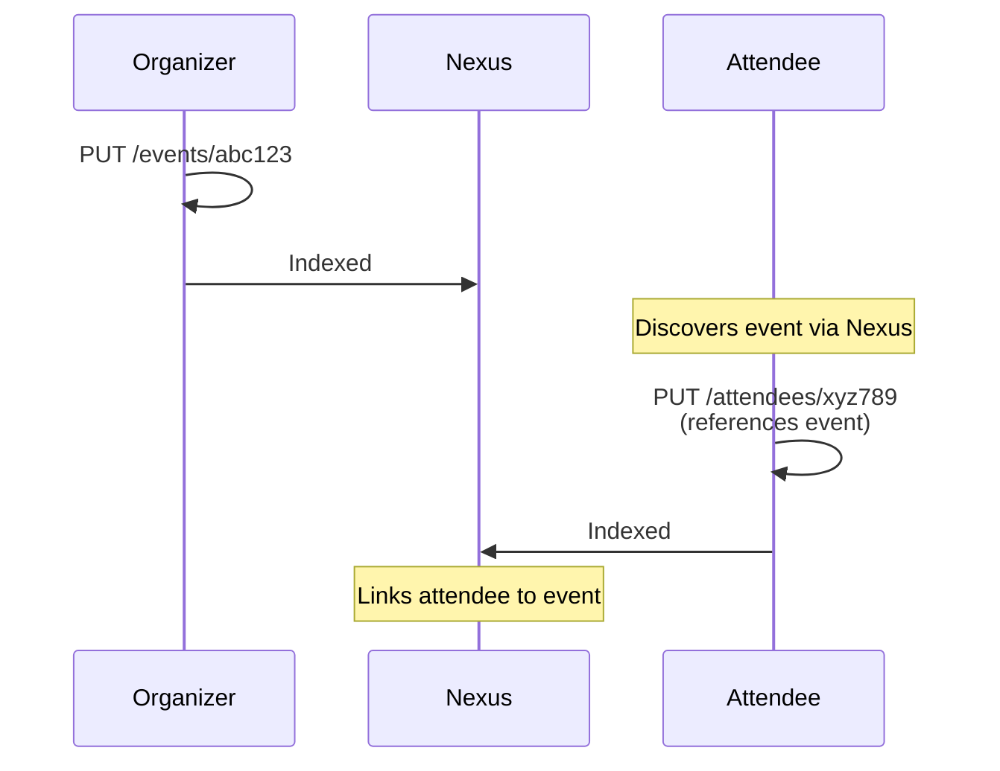
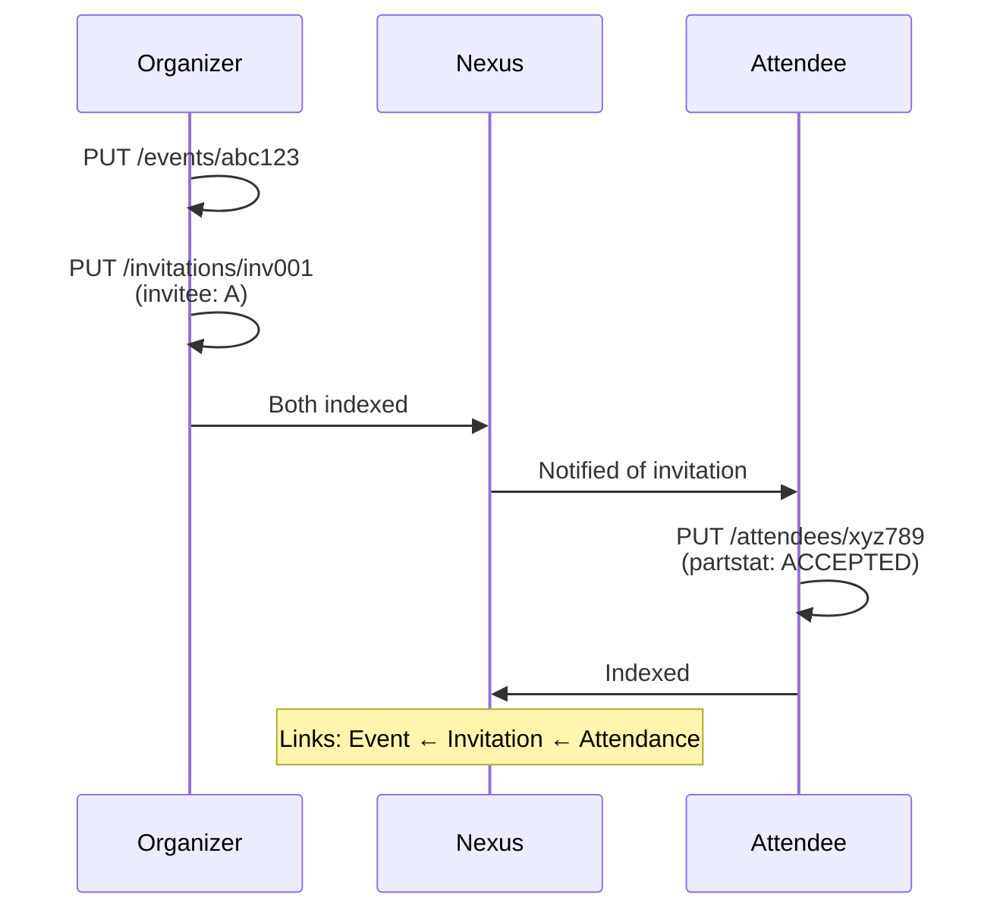
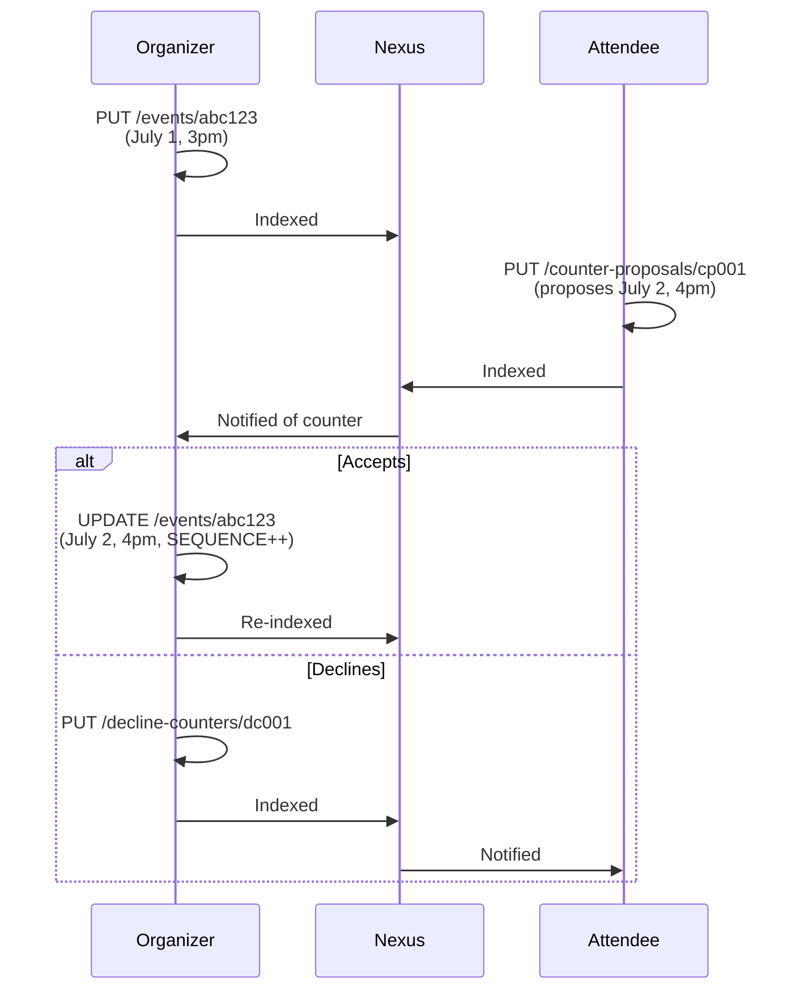

# iTIP, Scheduling & Access Control

Exploration of calendar/event scheduling and access control patterns, combining RFC 5546 (iTIP) concepts with Pubky's decentralized model.

## RFC 5546 iTIP Overview

iTIP defines how calendaring systems schedule events. Key concepts:

### Roles

| Role | Description | RFC Reference |
|------|-------------|---------------|
| **Organizer** | Creates and controls the event. Only one per event. | §2.1 |
| **Attendee** | Invited participants | §2.1 |
| **Chair** | Runs the meeting (may differ from Organizer) | §1.3 |
| **Delegate** | Attends on behalf of another | §2.1.2 |
| **Sent-By** | Acts on behalf of Organizer/Attendee | §2.1.3 |

### Methods

| Method | Who Sends | Description |
|--------|-----------|-------------|
| `PUBLISH` | Organizer | Broadcast event (no response expected) |
| `REQUEST` | Organizer | Invite attendees (response expected) |
| `REPLY` | Attendee | Respond to invitation |
| `ADD` | Organizer | Add instances to recurring event |
| `CANCEL` | Organizer | Cancel event or remove attendees |
| `REFRESH` | Attendee | Request latest event version |
| `COUNTER` | Attendee | Propose alternative time/place |
| `DECLINECOUNTER` | Organizer | Reject counter-proposal |

### Key Insight from RFC 5546

> "The 'Organizer' has complete control over the master iCalendar object."
> "Attendees do not make direct changes to the master iCalendar object."

---

## The Pubky Challenge

Traditional iTIP assumes:
- Centralized calendar servers
- Server-enforced access control
- Direct message delivery between servers

Pubky is different:
- User-owned data on homeservers
- No central authority
- Users create their own records

**Key Question:** How do we map iTIP's Organizer/Attendee model to Pubky's "everyone owns their own data" model?

---

## Possible Approaches

### Approach 1: Pure Self-Ownership (Current Model)

**How it works:**
- Organizer creates event on their homeserver
- Each attendee creates their own attendance record on their homeserver
- No one can write to anyone else's data

```
pubky://organizer/pub/eventky.app/events/abc123        → Event
pubky://attendee1/pub/eventky.app/attendees/xyz789     → Attendance record
pubky://attendee2/pub/eventky.app/attendees/xyz790     → Attendance record
```

**iTIP Mapping:**
- `PUBLISH` only — no `REQUEST/REPLY` semantics

---

### Approach 2: Organizer-Controlled Invitations

**How it works:**
- Organizer creates event AND invitation records
- Invitations stored on organizer's homeserver
- Attendees respond by creating attendance records

```
pubky://organizer/pub/eventky.app/events/abc123                    → Event
pubky://organizer/pub/eventky.app/invitations/inv001               → Invitation for attendee1
pubky://organizer/pub/eventky.app/invitations/inv002               → Invitation for attendee2
pubky://attendee1/pub/eventky.app/attendees/xyz789                 → RSVP response
```

**Invitation Record:**
```typescript
interface PubkyAppInvitation {
    x_pubky_event_uri: string;       // Event reference
    x_pubky_invitee_uri: string;     // Who is invited
    role: "CHAIR" | "REQ-PARTICIPANT" | "OPT-PARTICIPANT" | "NON-PARTICIPANT";
    rsvp: boolean;                   // Response requested?
    sent_at: number;
    created_at: number;
}
```

**iTIP Mapping:**
- `REQUEST` → Organizer creates invitation
- `REPLY` → Attendee creates attendance record
- `CANCEL` → Organizer deletes invitation

---

### Approach 3: Calendar-Level Access Control

**How it works:**
- Calendars have access levels (public, followers, specific users)
- Events inherit calendar permissions
- Access control stored as calendar metadata

```typescript
interface PubkyAppCalendar {
    // ... existing fields ...
    
    // Access control
    visibility: "public" | "followers" | "private";
    
    // Who can see events on this calendar?
    viewers?: string[];              // pubky:// URIs
    
    // Who can create events on this calendar?
    contributors?: string[];         // pubky:// URIs
    
    // Who can manage the calendar?
    admins?: string[];               // pubky:// URIs
}
```

**Access Levels:**

| Level | Can View | Can Create Events | Can Edit Calendar |
|-------|----------|-------------------|-------------------|
| `owner` | ✅ | ✅ | ✅ |
| `admin` | ✅ | ✅ | ✅ (limited) |
| `contributor` | ✅ | ✅ | ❌ |
| `viewer` | ✅ | ❌ | ❌ |
| `public` | ✅ | ❌ | ❌ |

**Pros:**
- ✅ Flexible permissions
- ✅ Supports shared calendars
- ✅ Familiar model (Google Calendar, etc.)

**Cons:**
- ❌ Requires permission checking (who enforces?)
- ❌ Complexity
- ❌ Not truly decentralized (owner controls)

**Open Question:** In Pubky, how do we enforce that only `contributors` can create events? The homeserver doesn't know about calendar permissions.

---

### Approach 5: Event-Level Permissions

**How it works:**
- Each event specifies its own access control
- Permissions embedded in event data
- Nexus enforces visibility in queries

```typescript
interface PubkyAppEvent {
    // ... existing fields ...
    
    // Event-level access control
    x_pubky_access?: {
        // Who can see this event?
        visibility: "public" | "invited" | "private";
        
        // Who can RSVP? (if different from visibility)
        rsvp_policy: "open" | "invited-only" | "approval-required";
        
        // Who can invite others?
        can_invite?: string[];       // pubky:// URIs or "attendees"
        
        // Capacity limits
        max_attendees?: number;
    };
}
```

**RSVP Policies:**

| Policy | Description |
|--------|-------------|
| `open` | Anyone can RSVP |
| `invited-only` | Only those with invitations can RSVP |
| `approval-required` | RSVPs require organizer approval |

**Pros:**
- ✅ Fine-grained control per event
- ✅ Supports various event types (public meetup vs private party)

**Cons:**
- ❌ Enforcement question (Nexus? Homeserver? Honor system?)
- ❌ Complexity

---

## Enforcement Considerations

In a decentralized system, where does enforcement happen?

### Option A: Nexus Enforcement (Indexer Level)

- Nexus indexes events with access control metadata
- Nexus filters queries based on requester identity
- Unauthorized data is not returned in API responses

**Problem:** Data still exists on homeserver; determined users can find it

### Option B: Application Enforcement (Client Level)

- Clients respect access control metadata
- Unauthorized events hidden in UI
- "Honor system" — bad actors can bypass

**Problem:** Security through obscurity

---

## Recommended Path Forward

### Phase 1: Simple Model (Now)
Keep current self-ownership model:
- Events are public or followers-only (via homeserver)
- Self-RSVP (no invitations)
- Party-crashing is possible

### Phase 2: Invitations (Next)
Add organizer-created invitations:
- Invitation records on organizer's homeserver
- Nexus indexes and links invitations to events
- Distinguishes "invited" vs "self-RSVPed"
- Still no enforcement — social convention

### Phase 3: Access Policies (Future)
Add event-level access metadata:
- `rsvp_policy` field on events
- Nexus respects policies in queries
- Clients enforce in UI
- Still technically bypassable

### Phase 4: Cryptographic Privacy (Far Future)
For truly private events:
- Event details encrypted
- Key shared with invitees
- Nexus indexes metadata only

---

## Data Flow Diagrams

### Current Model (Self-RSVP)



### With Invitations



### With Counter-Proposal



---

## Open Questions

1. **Who can cancel?** 
   - Only organizer? 
   - What if organizer disappears?
   - iTIP allows "Replacing the Organizer" (§4.2.11) — how in Pubky?

2. **Delegation chains:**
   - A invites B, B delegates to C, C delegates to D
   - How deep? Who tracks?

3. **Recurring event instances:**
   - Can attendee accept some instances but not others?
   - How to model per-instance RSVP?

4. **Group calendars:**
   - Multiple people managing one calendar
   - Requires Pubky group primitive (doesn't exist yet)

5. **Cross-homeserver notifications:**
   - How does attendee learn they're invited?
   - Push? Poll? Nexus subscription?

---

## References

- [RFC 5545 - iCalendar](https://www.rfc-editor.org/rfc/rfc5545) - Core calendar format
- [RFC 5546 - iTIP](https://www.rfc-editor.org/rfc/rfc5546) - Scheduling protocol
- [RFC 6047 - iMIP](https://www.rfc-editor.org/rfc/rfc6047) - Email transport for iTIP
- [Current Attendee Extensions](./ATTENDEE_EXTENSIONS.md) - Our attendee improvements
