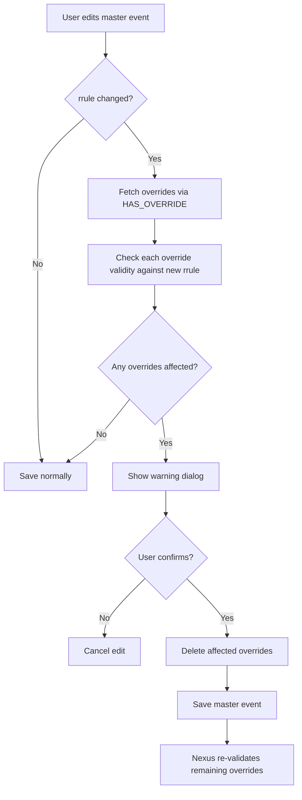
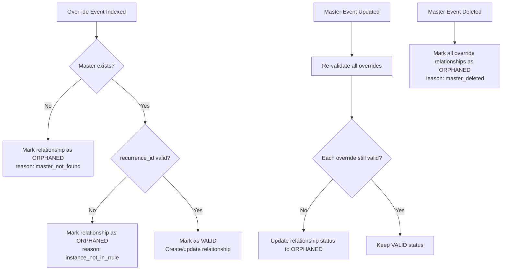

# Recurrence Instance Overrides

Extend eventky to support modifying individual instances of recurring events (RFC 5545 exception events).

---

## Table of Contents

1. [Overview](#overview)
2. [Current State](#current-state)
3. [Data Model](#data-model)
4. [Nexus Indexing](#nexus-indexing)
5. [UI/UX Design](#uiux-design)
6. [Edge Cases & Orphaning](#edge-cases--orphaning)
7. [Implementation Phases](#implementation-phases)

---

## Overview

### The Problem

Currently, eventky supports recurring events with `rrule`, `rdate`, and `exdate`, but organizers cannot modify individual instances. For example:

- Weekly team meeting, but this Thursday is rescheduled to Friday (Technically supported via `exdate` + new event, but not linked)
- Monthly book club, but January's meeting is at a different location
- Daily standup, but tomorrow's is cancelled (different from excluding via `exdate`)

### RFC 5545 Solution: Exception Events

RFC 5545 defines **exception events** (also called override events) using the `RECURRENCE-ID` property:

```
BEGIN:VEVENT
UID:weekly-meeting@example.com
DTSTART:20250115T100000
RECURRENCE-ID:20250115T100000    <-- This overrides the Jan 15 instance
SUMMARY:Weekly Meeting (RESCHEDULED)
LOCATION:Conference Room B       <-- Different location for this instance
END:VEVENT
```

The `RECURRENCE-ID` matches the original `DTSTART` of the instance being overridden.

### pubky-app-specs Support

The `PubkyAppEvent` builder already accepts a `recurrence_id` parameter:

```typescript
// From pubky-app-specs builder
createEvent(
    uid, dtstart, summary, dtend, duration, dtstart_tzid, dtend_tzid,
    description, status, location, geo, image_uri, url,
    rrule, rdate, exdate,
    recurrence_id,  // <-- Already supported!
    styled_description, x_pubky_calendar_uris, x_pubky_rsvp_access
): EventResult;
```

This field exists but is currently unused by eventky.

---

## Current State

### What Works

| Feature | Status |
|---------|--------|
| Create recurring events with `rrule` | Supported |
| Add specific dates via `rdate` | Supported |
| Exclude dates via `exdate` | Supported |
| RSVP to specific instances | Supported (via attendee `recurrence_id`) |
| Edit master event (affects all instances) | Supported |

### What's Missing

| Feature | Status |
|---------|--------|
| Override single instance properties | Not implemented |
| Reschedule single instance | Not implemented |
| Cancel single instance (with override, not exdate) | Not implemented |
| Per-instance location/description changes | Not implemented |

### Nexus Current Behavior

From `/home/gil/Repositories/pubky-nexus/nexus-common/src/models/event/details.rs`:

```rust
pub struct EventDetails {
    // ... other fields ...
    pub recurrence_id: Option<String>,  // Stored but not used for linking
}
```

Nexus stores `recurrence_id` but:
- No parent-child relationship between master and override events
- No instance expansion or merging
- Override events are indexed as independent events

---

## Data Model

### Override Event Structure

An override event is a separate `PubkyAppEvent` with:

1. **Same `uid`** as the master event (links them together)
2. **`recurrence_id`** set to the instance being overridden (ISO 8601 datetime)
3. **No `rrule`, `rdate`, or `exdate`** (override is for a single instance)
4. **Modified properties** (dtstart, location, summary, etc.)

```typescript
// Master event
{
    uid: "weekly-standup-abc123",
    dtstart: "2025-01-06T09:00:00",
    summary: "Weekly Standup",
    location: "Room A",
    rrule: "FREQ=WEEKLY;BYDAY=MO",
    recurrence_id: null  // Master has no recurrence_id
}

// Override for Jan 13 instance (rescheduled to Tuesday)
{
    uid: "weekly-standup-abc123",     // Same UID!
    dtstart: "2025-01-14T09:00:00",   // New time (Tuesday)
    summary: "Weekly Standup",
    location: "Room B",                // Different location
    rrule: null,                       // No rrule on overrides
    rdate: null,                       // No rdate on overrides
    exdate: null,                      // No exdate on overrides
    recurrence_id: "2025-01-13T09:00:00"  // Original instance datetime
}
```

### pubky-app-specs Validation

The `PubkyAppEvent` builder should enforce mutual exclusivity:

```typescript
// Proposed validation in pubky-app-specs
function createEvent(..., rrule, rdate, exdate, recurrence_id, ...) {
    if (recurrence_id != null) {
        if (rrule != null || rdate != null || exdate != null) {
            throw new Error(
                "Override events (with recurrence_id) cannot have rrule, rdate, or exdate. " +
                "These fields are only valid on master events."
            );
        }
    }
    // ... rest of validation
}
```

**Rationale:** An override event represents a single modified instance. Recurrence rules only make sense on the master event that defines the series. Allowing both would create ambiguous semantics (does the override's rrule create a sub-series?).

### Storage Path

Override events use the same path pattern but with a different event ID:

```
Master:   /pub/eventky.app/events/{event_id}
Override: /pub/eventky.app/events/{override_event_id}
```

The override gets its own ID (timestamp-based like all events), but shares the `uid` with the master.

### Property Inheritance

Overrides can specify only changed properties. Nexus computes the final instance by merging:

| Property | Override Behavior |
|----------|-------------------|
| `uid` | Must match master (required) |
| `recurrence_id` | Required (identifies which instance) |
| `dtstart` | Override wins (reschedule) |
| `dtend` / `duration` | Override wins, or inherit from master |
| `summary` | Override wins, or inherit |
| `description` | Override wins, or inherit |
| `location` | Override wins, or inherit |
| `geo` | Override wins, or inherit |
| `status` | Override wins (e.g., "CANCELLED") |
| `image_uri` | Override wins, or inherit |
| `url` | Override wins, or inherit |
| `rrule` | Always null on override |
| `rdate` / `exdate` | Only on master |

### Cancelled Instance via Override

To cancel a single instance (while keeping it visible as "cancelled" rather than hiding via `exdate`):

```typescript
{
    uid: "weekly-standup-abc123",
    dtstart: "2025-01-13T09:00:00",    // Keep original time for display
    summary: "Weekly Standup (CANCELLED)",
    status: "CANCELLED",
    recurrence_id: "2025-01-13T09:00:00"
}
```

**`exdate` vs `status: CANCELLED` override:**

| Approach | Behavior |
|----------|----------|
| `exdate` | Instance disappears completely |
| Override with `CANCELLED` | Instance shown as cancelled, RSVPs preserved |

---

## Nexus Indexing

### Relationship Model

Override events are linked to their master via an explicit `HAS_OVERRIDE` relationship:

```cypher
(:Event {recurrence_id: null})-[:HAS_OVERRIDE {status: 'VALID'}]->(:Event {recurrence_id: "2025-01-13T09:00:00"})
```

**Why use explicit relationships instead of shared `uid` queries?**

| Aspect | Relationship Model | Shared `uid` Query |
|--------|-------------------|-------------------|
| Query performance | Fast graph traversal | Requires `uid` index |
| Metadata on link | Yes (`status`, `validated_at`) | No |
| Write complexity | Must maintain relationship | Simpler writes |
| Orphan detection | Check relationship status | Query-time comparison |

**Decision:** Use explicit `HAS_OVERRIDE` relationship for performance and to store link metadata (e.g., `status: 'VALID' | 'ORPHANED'`).

### Relationship Properties

```cypher
[:HAS_OVERRIDE {
    status: 'VALID' | 'ORPHANED',
    created_at: timestamp,
    validated_at: timestamp,        // Last time we checked validity
    orphaned_reason?: string        // e.g., "instance_removed", "master_deleted"
}]
```

### Indexing Logic

When Nexus indexes an event with `recurrence_id`:

1. **Validate master exists:** Find event with same `uid` and `recurrence_id: null`
2. **Validate instance date:** `recurrence_id` should be a valid occurrence of the master's rrule
3. **Create relationship:** Link override to master
4. **Index independently:** Override is also searchable as an event

```rust
// Pseudocode for nexus-watcher handler
async fn sync_put_event(event: PubkyAppEvent, author_id: PubkyId, event_id: String) {
    if let Some(recurrence_id) = &event.recurrence_id {
        // This is an override event
        let master = find_master_event(&event.uid, &author_id).await?;
        
        if master.is_none() {
            // Orphaned override - master doesn't exist (yet?)
            // Index anyway, mark as orphaned
            index_orphaned_override(event, author_id, event_id).await?;
            return;
        }
        
        // Validate recurrence_id matches a valid instance
        let is_valid_instance = validate_instance_date(
            &master.rrule, 
            &master.dtstart, 
            recurrence_id
        );
        
        if !is_valid_instance {
            // recurrence_id doesn't match any occurrence - orphaned
            index_orphaned_override(event, author_id, event_id).await?;
            return;
        }
        
        // Valid override - create relationship
        create_override_relationship(&master, &event, event_id).await?;
    } else {
        // Regular event or master event
        index_regular_event(event, author_id, event_id).await?;
    }
}
```

### API Response: Event with Overrides

When fetching a recurring event, include full override data. This avoids needing a separate instance endpoint - the client can merge locally.

```typescript
interface EventViewWithOverrides {
    details: EventDetails;           // Master event
    tags: TagDetails[];
    attendees: AttendeeDetails[];    // All attendees (master + instance-specific)
    overrides: EventOverride[];      // Full override data for client-side merging
}

interface EventOverride {
    recurrence_id: string;           // Which instance this overrides
    event_id: string;                // Override event's ID
    details: EventDetails;           // Full override details (not partial)
    status: "VALID" | "ORPHANED";    // Whether recurrence_id still valid
}
```

**Why full override data instead of a separate instance endpoint?**

| Approach | Pros | Cons |
|----------|------|------|
| Separate instance endpoint | Server does merging | Extra request per instance view |
| Full overrides in event fetch | Single request, client merges | Slightly larger payload |

Since the event view already needs override metadata for the instance selector, returning full override data adds minimal overhead and eliminates the need for additional requests when switching instances.

### Client-Side Merging

Eventky performs the merge when displaying a specific instance:

```typescript
function getMergedInstance(
    master: EventDetails,
    overrides: EventOverride[],
    instanceDate: string
): EventDetails {
    const override = overrides.find(o => o.recurrence_id === instanceDate);
    
    if (!override || override.status === "ORPHANED") {
        // No override or orphaned - use master with adjusted dtstart
        return {
            ...master,
            dtstart: instanceDate,
            // Compute dtend based on master's duration
        };
    }
    
    // Override exists - use override details
    // Override already has correct dtstart (possibly rescheduled)
    return override.details;
}
```

### Event Streams

Event streams should also include overrides for recurring events:

```typescript
interface EventStreamItem {
    details: EventDetails;
    tags: TagDetails[];
    // For recurring events only:
    overrides?: EventOverride[];
}
```

**Note:** For stream performance, consider limiting to valid overrides only (exclude orphaned) and/or limiting to overrides for upcoming N instances.

---

## UI/UX Design

### Current Event View Structure

The event view page (`/event/[authorId]/[eventId]`) displays:
- Event details (title, description, location, etc.)
- Instance selector component for recurring events (select which instance to view)
- Edit button (top of page) for event owner
- RSVP actions for attendees

### Organizer Experience

#### Event View Actions

When viewing a recurring event, the edit button behavior depends on context:

**Viewing an unmodified instance:**
- Edit button dropdown shows:
  - "Edit this instance" → Creates new override
  - "Edit event series" → Opens master event form

**Viewing an overridden instance:**
- Edit button dropdown shows:
  - "Edit this override" → Opens override form
  - "Edit event series" → Opens master event form
- Delete button dropdown shows:
  - "Delete this override" → Removes override, instance reverts to series default
  - "Delete event series" → Deletes master + all overrides (with confirmation)

#### Instance Selector Indicators

The instance selector component should show visual indicators for overridden instances:
- Default instance: No indicator
- Rescheduled: Badge or icon indicating different date/time
- Modified: Badge indicating changed properties (location, description, etc.)
- Cancelled: Strikethrough or cancelled badge

#### Override Form vs Series Form

**Series Form (editing master event):**
- Full event form with all fields
- Includes recurrence builder (rrule, rdate, exdate)
- Changes affect all non-overridden instances

**Override Form (editing single instance):**
- Subset of event form fields (no recurrence builder)
- Each field shows the series default value as placeholder/preview
- Only save fields that differ from series default
- Clear indication of what's being overridden vs inherited
- "Revert to series default" action to delete the override

#### Form Field Behavior for Overrides

When editing an override:
1. **Placeholder values:** Show series default in each field as placeholder text
2. **Empty = inherit:** If field is cleared, it inherits from series (not saved in override)
3. **Visual distinction:** Fields that differ from series default should be visually marked
4. **Preview mode:** Form shows what the instance will look like, but only changed fields are persisted

Example flow:
- Series has `location: "Room A"`
- User opens override form, sees "Room A" as placeholder
- User changes to "Room B" → field is marked as overridden
- User clears the field → reverts to placeholder, not saved in override
- On save: only `location: "Room B"` is stored (if changed)

#### Delete Confirmation Dialogs

**Deleting an override:**
- Simple confirmation: "Delete this instance override? The instance will revert to series defaults."

**Deleting event series:**
- Lists all overrides that will also be deleted
- Shows count of RSVPs that will be affected
- Requires explicit confirmation

**Editing series with affected overrides:**
- Before save: detect if rrule change would orphan overrides
- Show warning listing affected overrides
- Options: "Cancel", "Save & delete affected overrides"

### Attendee Experience

Attendees see the **computed instance** with overrides merged:
- Seamless experience - no awareness of override mechanism
- Rescheduled instances show indicator and original date context
- Cancelled instances show cancelled state with appropriate messaging
- RSVPs work normally (tied to `recurrence_id`)

### Calendar View

Calendar displays should show override indicators on affected dates:
- Rescheduled: Show on new date with indicator, optionally show original date crossed out
- Cancelled: Show with cancelled styling
- Modified: Show with modified indicator

---

## Edge Cases & Orphaning

### When Overrides Become Orphaned

An override becomes orphaned when its `recurrence_id` no longer matches a valid instance:

| Scenario | Outcome |
|----------|---------|
| Master rrule changed, instance no longer exists | Override orphaned |
| Master event deleted | All overrides orphaned (relationship broken) |
| Master dtstart changed, shifts all instances | Overrides orphaned (recurrence_id mismatch) |
| Instance added to exdate | Override orphaned (explicitly excluded) |

### Eventky Deletion Behavior

**Principle:** Eventky should handle override cleanup to avoid orphans accumulating in Nexus.

#### Deleting Master Event

When organizer deletes a master recurring event:

1. **Fetch all overrides** via `HAS_OVERRIDE` relationship
2. **Show confirmation dialog** listing affected overrides:

```
┌─────────────────────────────────────────────────────────────┐
│  Delete Recurring Event                                     │
│                                                             │
│  Are you sure you want to delete "Weekly Standup"?          │
│                                                             │
│  ⚠️ This will also delete 3 instance overrides:             │
│                                                             │
│    • Jan 14 - Rescheduled to Tuesday                       │
│    • Jan 20 - Cancelled                                     │
│    • Feb 3 - Different location (Room B)                   │
│                                                             │
│  All RSVPs for this event series will be lost.             │
│                                                             │
│  [Cancel]                              [Delete All]         │
└─────────────────────────────────────────────────────────────┘
```

3. **Delete overrides first**, then master event
4. Nexus removes `HAS_OVERRIDE` relationships automatically on node deletion

#### Editing Master Event (rrule Changes)

When organizer edits a recurring event and the rrule change would orphan overrides:

1. **Before save:** Check which overrides would become invalid
2. **If overrides affected:** Show warning dialog:

```
┌─────────────────────────────────────────────────────────────┐
│  ⚠️ Override Conflict                                        │
│                                                             │
│  Changing the recurrence pattern will affect these          │
│  instance overrides:                                        │
│                                                             │
│  ┌─────────────────────────────────────────────────────┐   │
│  │ ❌ Jan 13 override (Mon no longer in pattern)       │   │
│  │    → Will be deleted                                 │   │
│  │                                                      │   │
│  │ ✓ Jan 21 override (still valid on new pattern)      │   │
│  │    → Will be kept                                    │   │
│  └─────────────────────────────────────────────────────┘   │
│                                                             │
│  [Cancel]  [Save & Delete Affected Overrides]               │
└─────────────────────────────────────────────────────────────┘
```

3. **On confirm:** Delete affected overrides, then save master event
4. **Alternative:** User can cancel and adjust overrides first

#### Implementation Flow



### Orphan Handling Strategy (Nexus)

Even with Eventky cleanup, orphans can still occur (e.g., direct homeserver edits, race conditions):



### UI for Orphaned Overrides

Show organizers their orphaned overrides:

```
┌─────────────────────────────────────────────────────────────┐
│  ⚠️ Orphaned Overrides                                      │
│                                                             │
│  These instance modifications no longer match the series    │
│  pattern. This can happen when the recurrence rule changes. │
│                                                             │
│  ┌─────────────────────────────────────────────────────┐   │
│  │ Override for: Mon, Jan 13, 2025 (no longer exists)  │   │
│  │ Changes: Rescheduled to Tue, Jan 14, Location: B    │   │
│  │                                                      │   │
│  │ [Delete Override]  [Convert to Standalone Event]    │   │
│  └─────────────────────────────────────────────────────┘   │
└─────────────────────────────────────────────────────────────┘
```

### Edge Cases Table

| Scenario | Behavior |
|----------|----------|
| Create override before master indexed | Override indexed as orphaned, linked when master appears |
| Delete master event (via Eventky) | User warned, all overrides deleted with master |
| Delete master event (direct homeserver) | Overrides become orphaned in Nexus |
| Change master rrule, some overrides still valid | User warned about affected overrides, can confirm deletion |
| Override for exdate'd instance | Orphaned (exdate takes precedence) |
| Override and exdate for same instance | exdate wins, override orphaned |
| Change master dtstart by 1 hour | All overrides orphaned (recurrence_id mismatch), user warned |
| Override has same dtstart as recurrence_id | Valid (no reschedule, just property changes) |
| Override dtstart conflicts with another instance | Allowed (two events on same day) |
| User RSVPs to orphaned override | RSVP preserved but shown with warning |
| Multiple overrides for same instance | Last write wins (by indexed_at) |

### Data Preservation

**Nexus Principle:** Never auto-delete user data. If orphans occur (e.g., direct homeserver edits), they are:
1. Marked as orphaned (relationship status field)
2. Hidden from normal event views
3. Shown in organizer's "orphaned" section
4. Preserved until organizer explicitly deletes

**Eventky Principle:** Proactively clean up overrides to prevent orphans:
1. When deleting master → delete all overrides (with user confirmation)
2. When editing rrule → delete affected overrides (with user warning)
3. User always sees what will be deleted before confirming

### Re-linking Orphaned Overrides

If master rrule changes back, previously orphaned overrides can become valid again:

```typescript
// When master event is updated
async function revalidateOverrides(master: EventDetails) {
    const overrides = await getOverridesForMaster(master.uid);
    
    for (const override of overrides) {
        const isValid = isValidInstance(
            master.rrule,
            master.dtstart,
            master.exdate,
            override.recurrence_id
        );
        
        if (isValid && override.status === "ORPHANED") {
            // Re-link!
            await updateOverrideStatus(override.id, "VALID");
        } else if (!isValid && override.status === "VALID") {
            // Orphan
            await updateOverrideStatus(override.id, "ORPHANED");
        }
    }
}
```

---

## Implementation Phases

### Phase 1: Data Model & Nexus (Backend)

**pubky-app-specs changes:**
- [ ] Expose `recurrence_id` on `PubkyAppEvent` class (already in builder)
- [ ] Add builder validation: if `recurrence_id` is set, reject `rrule`, `rdate`, and `exdate`
- [ ] Add validation: override events cannot define recurrence patterns

**Nexus changes:**
- [ ] Add `HAS_OVERRIDE` relationship with status and metadata
- [ ] Index override events with master validation
- [ ] Implement orphan detection and status tracking on relationship
- [ ] Update `get_event` to include full override data via relationship traversal
- [ ] Update event streams to include overrides for recurring events
- [ ] Re-validate overrides when master updated
- [ ] Mark overrides as orphaned (not delete) when master deleted

### Phase 2: Basic UI (Create/Edit Overrides)

**Eventky changes:**
- [ ] Implement client-side instance merging utility
- [ ] Add "Edit this instance" / "Edit event series" options in event detail
- [ ] Create override editor form (no recurrence builder, shows series defaults as placeholders)
- [ ] Show override indicators in instance selector
- [ ] Implement "Revert to series default" action (delete override)

### Phase 3: Override Cleanup & Full UI

**Eventky deletion handling:**
- [ ] Fetch overrides before deleting master event
- [ ] Show confirmation dialog listing all overrides that will be deleted
- [ ] Delete overrides first, then master event
- [ ] On rrule edit: detect which overrides would be orphaned
- [ ] Show warning dialog with affected overrides before save
- [ ] Delete affected overrides on user confirmation

**Full UI integration:**
- [ ] Calendar view with override indicators
- [ ] Orphaned overrides management section (for edge cases)
- [ ] "Convert to standalone event" for orphans
- [ ] Recurrence preview with override/exclude actions
- [ ] Attendee view with rescheduled/cancelled banners

### Phase 4: Advanced Features

- [ ] "Edit this and future instances" (splits series)
- [ ] Bulk override management
- [ ] Override templates (e.g., "always Room B on first Monday")
- [ ] Notification to attendees when instance modified

---

## References

- [RFC 5545 - iCalendar](https://www.rfc-editor.org/rfc/rfc5545) - Section 3.8.4.4 (RECURRENCE-ID)
- [pubky-app-specs](https://github.com/pubky/pubky-app-specs) - PubkyAppEvent model
- [Google Calendar API - Instances](https://developers.google.com/calendar/api/concepts/events-calendars#recurring_events)
- [eventky RECURRENCE.md](../RECURRENCE.md) - Current recurrence implementation
